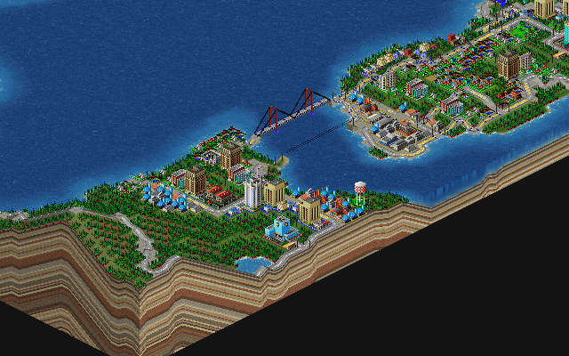
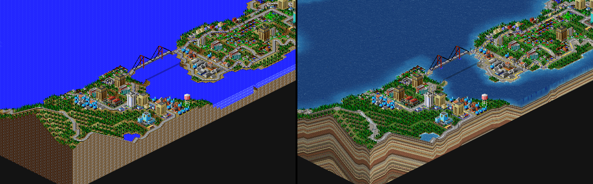

# Arcology

A from-scratch reconstruction of the SimCity 2000 simulation engine, verified against the original Mac 68k binary (my
favourite version), with a modern renderer and multi-city regions.

Not a remake and not an emulator. The simulation is C, rebuilt one routine at a time by reading Motorola 68000 out of
the retail Macintosh release and checking every pass against the original's own code running under an interpreter. Where
the two disagree, the original is right.



*Bayview, running. The simulation is the reconstruction; the terrain is the new renderer.*

### The old renderer and the new one



Same city, same frame, same simulation underneath. On the left is the original's own terrain and water art, drawn from
the atlas the 1995 build drew from -- flat tiles and a repeating water pattern. On the right is the terrain mesh and the
water shader: real lighting on the ground, depth in the water, and the geological strata the map's altitude data implied
all along and the sprites had no way to show.

Both are always available -- `t` and `y` switch terrain and water while the game runs, and `--sprites` or `--geometry`
picks one for a headless render. The sprite path is not a legacy mode: it is the pixel-exact baseline the renderer is
tested against, so the two cannot drift apart without the test saying so.

These images are generated from the current build by `cmake --build build --target showcase`. If they look out of date,
they are -- regenerate them.

---

## Where it stands

The whole 25-phase monthly clock runs, and it runs *exactly*: over six shipped cities, a full month each,

| | |
|---|---|
| map layers | **335928 / 335928** live cells |
| scalars | **5760 / 5760** |
| random draws | **6 / 6** cities identical, draw for draw |

Across all 84 readable cities, the six data layers -- pollution, land value, density, police, fire and crime -- match on
**564821 of 564821** live cells. All fourteen disasters reproduce tile for tile, and the year-end pass over every
special building on the map -- power plants ageing toward failure, the prisons that set the police radius, the
arcologies -- is exact on **894 of 894** records.

"Draw for draw" is the standard that matters. The simulation consumes seven different random generators, and reproducing
the *sequence* of draws means the reconstruction is taking the same branches as the original, not merely arriving at a
similar answer.

## Building

```
cmake -B build
cmake --build build
./build/arcology
```

SDL3 is found if installed, or fetched with `-DSC2K_FETCH_SDL3=ON`. Dear ImGui and spdlog are fetched at configure time.

To run the verification suite you need your own copy of the game:

```
cmake -B build -DSC2K_CITIES="/path/to/SimCity 2000 Collection"
ctest --test-dir build
```

## Running

```
arcology                       the load menu
arcology Bayview               open a city
arcology --verify <dir>        the verification report
arcology --clock <city> 25 <out>   one month, dumped for comparison
```

`arcology --help` lists the rest.

Every letter shortcut takes the platform's command key -- ⌘ on the Mac, Ctrl elsewhere -- and the menus show which.
The original's own shortcuts keep its letters (⌘L load, ⌘S save, ⌘Q quit, ⌘B budget, ⌘C population, ⌘G graphs); the
port's view switches add shift (⇧⌘T geometry, ⇧⌘G grid, ⇧⌘P screenshot, ⇧⌘M plain sweep, ⇧⌘U underground, ⌘V and
⇧⌘V through the data views). The bare keys are game controls, not menu shortcuts: 1 to 5 for the speeds, space to
pause, + and - to zoom, [ and ] for the pixel scale, the arrows to scroll.

## Importing the game's resources

Arcology ships no art, no sound and no interface graphics. All of it is read out of a real, Macintosh SimCity 2000
installation, so the first thing to do after building is import it:

```
python3 tools/import_assets.py "/path/to/SimCity 2000 Collection"
```

That writes `assets/` and takes a few seconds. Then `./build/arcology` works.

### What it is doing

The game keeps everything in the **resource fork** of its application file -- a second data stream classic Mac OS
attached to every file. On macOS the fork is still there and the script finds it by itself. On Linux or Windows you need
it as a separate file first (a `.rsrc` beside the application, or extracted with `unar`), and then:

```
python3 tools/import_assets.py --rsrc path/to/sc2k.rsrc
```

Three extractors run in turn, and each can be run on its own:

| resource | tool | what comes out |
|---|---|---|
| `SHAP` | `tools/sc2kpack.py extract` | `tiles8/16/32.png` + JSON -- the map art, 500 tiles at three zooms |
| `PICT` | `tools/pict.py --atlas` | `ui.png` + `ui.json` -- the interface graphics |
| `snd ` | `tools/snd.py` | `sounds/*.wav` -- the effects |

The tile art is stored interleaved in a MIFF container as ids *N*, *N*+500 and *N*+1000, one per zoom. `sc2kpack.py`
unpacks that into ordinary palette-indexed PNGs with JSON sidecars, so you can open the game's art in any image editor,
change it, and the game will load what you saved. `sc2kpack.py verify` checks that a pack round-trips.

Nothing in the import needs anything outside the Python standard library.

### Kaleidoscope themes

The interface can wear a **Kaleidoscope** scheme -- the classic Mac OS theming format from the late nineties. Point
`tools/scheme.py` at a scheme's resource fork and it becomes a theme pack:

```
python3 tools/scheme.py rsrc/scheme-classic7.rsrc assets/themes/classic7
```

`classic7`, Apple's System 7 look, is worn by default. **Options > Theme** lists every pack under `assets/themes/` and
None; a choice is remembered in `settings.json` in the per-user settings folder (Application Support on macOS, AppData on
Windows, `~/.local/share` on Linux) and comes back next run. `--theme NAME`, `--theme DIR` or `--theme none` overrides it
for one run.

Window frames, buttons, scroll bars, menu bars and title bars all come from the scheme, so a Kaleidoscope scheme written
in 1998 for a completely different program themes Arcology today.

### Cities

The repository carries the 101 cities from the collection, lowercased with a `.sc2` extension, so `arcology bayview`
works from a fresh clone with nothing else set up.

Cities load from `.SC2` files -- the ones the game shipped, and any made since. The reader and writer round-trip all 103
cities in the collection losslessly.

## The `.arco` format

The 1995 save is an IFF file: big-endian chunks, a bespoke run-length codec, a 4800-byte block of unnamed longs, and a
map that is 128x128 because the code says so. Arcology reads and writes it exactly and always will -- it is the import
path and the reference baseline. It is not a format to build a bigger game on.

`.arco` is that format, and it is **a ZIP archive**. That one decision buys most of what a modern format needs:

```
$ unzip -l bayview.arco
   world.json               dimensions, chunk size, the city list
   cities/0.json            treasury, budget, indicators
   cities/0/misc.bin        the state that has not been named yet
   cities/0/graphs.bin      sixteen series, 52 samples each
   chunks/0_0/altm.bin      terrain altitude, 16-bit little-endian
   chunks/0_0/xbld.bin      buildings
   ...
```

The manifest is JSON you can read, diff and hand-edit. The grids stay binary, because a 512x512 array of bytes has no
business being ASCII, and deflate beats the original's RLE on them anyway. A new feature adds a *file*, and a reader
that does not know that file ignores it -- there is no chunk registry to coordinate.

Three things it can express that the original cannot, and they are why it exists:

- **The world is chunked and unbounded.** Chunk size lives in the manifest, not in the code. An imported save is a
  128x128 patch written into whatever chunks it spans, and nothing about it has to stay 128 afterwards.
- **A city is a mask, not a rectangle.** Ownership is per tile, so a city's limits can follow its development and two
  cities can meet.
- **Altitude is 16 bits and unclamped.** The one-level-step rule is the original's; the faithful mode keeps it and the
  enhanced mode does not.

Converting either way:

```
arcology --convert bayview.sc2 bayview.arco
arcology --convert bayview.arco bayview.sc2
```

The game opens either without being told which is which.

**What holds it honest.** Going through `.arco` must lose nothing. `tools/arco_check.py` converts every city twice --
once straight to `.sc2` and once through `.arco` first -- and requires the two to be byte-identical. All **101 of 101**
are. (Against the *original* file, 39 of 101 come back byte-exact; the other 62 differ in RLE encoding, which is the
`.sc2` writer's doing and predates this format.) Anything the reconstruction has not named yet rides along in
`misc.bin`, so naming a field later changes the manifest, never what a file can hold.

## Layout

```
src/sim/       the simulation, C99
src/render/    the renderer: assets, camera, SDL_GPU, Dear ImGui
src/vendor/    lodepng, shared by the renderer's PNGs and .arco's deflate
cities/        the collection, lowercase .sc2
tools/         the 68k interpreter, the oracle, and the checkers
docs/          the reverse-engineering write-up and a functional reference
```

`tools/runsim.py` is the load-bearing piece: it builds the game's own A5 world from a save file and runs the original's
68k under `tools/m68kemu.py`. Every checker in `tools/` diffs the C against that, so a disagreement is a transcription
error with the save file's snapshot skew removed.

---

## Copyright and attribution

**SimCity 2000 is copyright © 1993-1995 Maxis, now part of Electronic Arts Inc.** SimCity, SimCity 2000 and Maxis are
trademarks or registered trademarks of Electronic Arts Inc. This project is not affiliated with, endorsed by, or
connected to Electronic Arts or Maxis in any way.

Arcology contains no code, art, sound or data from the original game. It is an independent reimplementation written from
behavioural observation, and it requires a legitimate copy of SimCity 2000 to run. Nothing here is a substitute for
owning the game.

Original SimCity 2000 design and programming by Will Wright and Fred Haslam at Maxis.

The optional joke advisor messages are from *SimCity Advisors* by Bob "BobServo" Mackey, published on Something Awful.
They are off by default and can be switched off entirely; the plain advisors are reconstructed from the game.

Third-party libraries, each under its own licence: SDL3 (zlib), Dear ImGui (MIT), spdlog (MIT).

Arcology itself is copyright © 2026 the Arcology authors.

## Topics

`simcity-2000` `sc2k` `reverse-engineering` `68k` `city-simulation` `game-preservation`
