.. _mechanics:

=========
Mechanics
=========

.. container:: eyebrow

   Functional reference · reconstructed from the 68k binary

.. container:: lede

   How the simulation actually works: what runs, in what order, and with which formulas. Every rule here was recovered from the retail Macintosh binary and checked against the game's own code running under an interpreter.

.. grid:: 1 1 3 3
   :gutter: 2
   :class-container: stats

   .. grid-item-card:: 22 Jun 1995

      SimCity 2000® 1.2

   .. grid-item-card:: 25

      phases per cycle

   .. grid-item-card:: 103

      cities as ground truth

The clock
---------

.. rubric:: simTick (``$21EDE``) · one phase per day

The simulation is a 25-entry jump table. Each in-game day advances a counter, takes it modulo 25, and runs exactly one phase. Nothing else drives the model — there is no continuous update, no event queue. A full cycle is 25 days, and the game year is 300 days, so a city goes round this clock twelve times a year.

.. list-table::
   :header-rows: 0
   :widths: 22 46 32
   :class: clock

   * - PHASE 0
     - Budget
     - ``budgetPass``
   * - PHASE 1
     - Power grid
     - ``powerGridReset``
   * - PHASE 2
     - City scan
     - ``cityScanPass``
   * - PHASES 3–18
     - Growth, sixteen slices of the map
     - ``growthScan ×16``
   * - PHASE 19
     - Traffic total
     - ``trafficTotal``
   * - PHASE 20
     - Water grid
     - ``waterGrid``
   * - PHASE 21
     - Population, economy
     - ``populationPass``
   * - PHASES 22–24
     - Redraw the graphs
     - ``not simulation``

The clock's own speed
~~~~~~~~~~~~~~~~~~~~~

.. rubric:: the main loop (``$00000C``) · idlePump (``$009728``) · the thing stepper (``$009E0A``)

The clock is driven by the main loop, once per pass through it, against the Toolbox tick counter at 60 ticks a second. The speed is ``MISC[1019]``, the word at ``A5+0x0C0A``, and it holds 1 to 5 in every shipped save. The Speed menu writes it, and a disaster forces 4.

.. list-table::
   :header-rows: 1
   :widths: auto

   * - Speed
     - Menu item
     - What the loop does
   * - 1
     - Pause
     - no phase runs, the movers stand still, the palette is still
   * - 2
     - Turtle
     - one phase when the tick counter passes a deadline set 36 ticks after the last phase
   * - 3
     - Llama
     - the same, with a deadline of 12 ticks
   * - 4
     - Cheetah
     - the same, with a deadline of 0 ticks, so one phase per pass once a tick has elapsed
   * - 5
     - African Swallow
     - one phase per pass, with no deadline test at all

The three delays are a word table at ``A5+0x0C9A`` indexed by the speed: 0, 0, 36, 12, 0. Speed 0 and speed 1 never tick.

Two more schedules hang off the same counter. The thing stepper, which moves the trains, boats and aircraft, runs at most every 15 ticks at any speed above 1, and every 30 in city mode 2. The palette animation runs in ``idlePump``: the 49-entry run at indices 155 to 203 turns every 12 ticks and the 15-entry run at 224 to 238 every 90 ticks, each through a permutation table (``A5-0x64B0`` and ``A5-0x644E``, 49 and 15 words) rather than a plain shift. Speed 5 skips both runs, and speed 1 skips them too.

Phase 0 begins by refreshing the month and the year count from the date (``$01523E``, ``$015268``) before the budget reads them. Phase 22 promotes the city a stage when its population exceeds the next rung of a ten-entry ladder at ``A5-0x3ED8`` -- 2,000, 10,000, 30,000, 60,000, 90,000, 120,000, 500,000, 1,000,000 and 5,000,000, indexed by ``MISC[8]`` plus one -- then runs the scenario check and declares bankruptcy below -100,000 in funds. The newspaper, the reward prompt and the graph windows that the last three phases draw are interface, not simulation.

Two thirds of the clock is growth. That is the single most important structural fact about this simulation: the map is not swept every tick. It is divided into a 4×4 lattice, and each of the sixteen growth phases visits one residue class — phase 3 takes every tile where ``y≡0, x≡0 (mod 4)``, phase 4 takes ``y≡0, x≡1``, and so on. Over sixteen days every tile is visited exactly once.

.. admonition:: Why that matters when you read a save file
   :class: note

   A saved city is caught mid-cycle. Values written at phase 2 describe a map that phases 3–18 have already changed underneath them. Any two numbers computed in different phases are not consistent with each other, and no amount of care in the reconstruction can make them so.

The map
-------

.. rubric:: fixTerrain (``$128DE``) · fixNeighbourhood (``$12C04``) · canRaise (``$8758``) · raiseTile (``$896C``)

.. rubric:: Everything else in this document sits on top of a 128 × 128 grid whose shape is held in two layers. ALTM says how high each tile is. XTER says what shape it is — and XTER is not something the map stores independently: it is *derived* from the altitudes around it, recomputed every time the land moves.

Altitude
~~~~~~~~

ALTM is sixteen bits a tile, and the simulation uses ten of them.

   One ALTM entry. Only the ten low bits mean anything to the simulation, and only the five lowest are read for their value.

**Bits 0–4 are the altitude**, and they are the only part read for its value: twenty sites in the reconstruction mask ALTM with ``$1F``, and the only other mask that appears anywhere is the ``$FC1F`` of the two writes described below. The field holds 0–31; raising stops at 30. Across the seventeen shipped cities the highest tile is 18, so more than a third of the range is never used.

**Bits 5–9 hold the city’s water level**, stamped onto a tile at the moment it goes under. The water level itself is a single number for the whole city, ``MISC[912]``, and it is 0, 4 or 5 in every shipped city. Writing it per tile is redundant — the code that reads a tile’s wetness reads XBIT bit 2, not this — but ``fixTerrain`` writes it faithfully, so the reconstruction does too.

**Bits 10–15 are never read and never written.** The two sites that touch ALTM for anything other than the altitude use the mask ``$FC1F``, which preserves them exactly. Fifteen of the seventeen shipped cities have them zero throughout. Barcelona and Oakland do not. Oakland’s are 123 tiles in three rows of 41 — rows 49, 51 and 53, two apart — and on every one of them the field holds *altitude minus five* exactly.

.. note::

   Three even rows of equal length, all obeying one arithmetic relation, is not noise — something drew them deliberately. But the field is inert: nothing in the simulation reads it, and carrying it through unchanged reproduces the original exactly. What wrote it, and what it meant, is the honest edge of what this reconstruction knows about ALTM.

A tile has no slope of its own
~~~~~~~~~~~~~~~~~~~~~~~~~~~~~~

.. container:: where

   **fixTerrain** ``$128DE`` · **corner table** ``A5-0x4DF6`` · **code table** ``A5-0x4DEE``

A tile’s shape is a function of its eight neighbours and nothing else. Each neighbour that stands *higher* lifts the corners of this tile that it touches, and the resulting four-bit set of raised corners indexes a table of slope codes.

   The four corner bits — 0 north-west, 1 south-west, 2 south-east, 3 north-east — sit on the tile’s corners, which are exactly the points it shares with its neighbours.

   Each higher neighbour contributes its corners to one four-bit mask. A side neighbour lifts both corners of the shared edge; a diagonal lifts the single corner it touches.

The eight are accumulated into one mask, and the mask picks the code:

.. list-table::
   :header-rows: 1
   :widths: auto

   * - Mask
     - Corners raised
     - Code
     - Mask
     - Corners raised
     - Code
   * - 0
     - none — flat
     - 0
     - 8
     - NE
     - 12
   * - 1
     - NW
     - 9
     - 9
     - NW + NE — north edge
     - 1
   * - 2
     - SW
     - 10
     - 10
     - SW + NE — saddle
     - 13
   * - 3
     - NW + SW — west edge
     - 2
     - 11
     - NW + SW + NE
     - 5
   * - 4
     - SE
     - 11
     - 12
     - SE + NE — east edge
     - 4
   * - 5
     - NW + SE — saddle
     - 13
     - 13
     - NW + SE + NE
     - 8
   * - 6
     - SW + SE — south edge
     - 3
     - 14
     - SW + SE + NE
     - 7
   * - 7
     - NW + SW + SE
     - 6
     - 15
     - all four
     - :bdg-warning:`$32`

Two things fall out of that table. **The two saddles share code 13** — a tile raised at NW+SE and one raised at SW+NE are the same shape as far as the map is concerned — so fifteen distinct corner sets produce only fourteen codes, 0 through 13. The value 14 sits in no entry and can never appear in XTER.

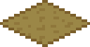

   The fourteen codes as the game draws them, at the 32 px set and magnified four times. Code 13 appears once because the two saddles share it. Reading the pictures against the corner column is what confirms the numbering is the right way round: a shape raised at NW + NE has its far edge up, and the sprite shows it.

.. list-table::
   :header-rows: 1
   :widths: auto

   * - Shape
     - Code
     - Mask
     - Corners raised
     - TSET
   * - |img1|
     - 0
     - 0
     - none — flat
     - 1256
   * - |img2|
     - 1
     - 9
     - NW + NE
     - 1257
   * - |img3|
     - 2
     - 3
     - NW + SW
     - 1258
   * - |img4|
     - 3
     - 6
     - SW + SE
     - 1259
   * - |img5|
     - 4
     - 12
     - SE + NE
     - 1260
   * - |img6|
     - 5
     - 11
     - NW + SW + NE
     - 1261
   * - |img7|
     - 6
     - 7
     - NW + SW + SE
     - 1262
   * - |img8|
     - 7
     - 14
     - SW + SE + NE
     - 1263
   * - |img9|
     - 8
     - 13
     - NW + SE + NE
     - 1264
   * - |img10|
     - 9
     - 1
     - NW
     - 1265
   * - |img11|
     - 10
     - 2
     - SW
     - 1266
   * - |img12|
     - 11
     - 4
     - SE
     - 1267
   * - |img13|
     - 12
     - 8
     - NE
     - 1268
   * - |img14|
     - 13
     - 5, 10
     - NW + SE / SW + NE
     - 1269

Two things the art states that the tables do not. **The far edges that slope down from a raised corner are drawn at three pixels per four rows**, while the projection of that edge is four per five: on sprite 257 the right edge is the line from the outer end of the two-pixel top belt with slope 0.75, matched row for row, and 0.75 is the altitude step over the tile height. A polygon filled from the true geometry is therefore one pixel inside the sprite on about half the rows of every such edge, at every zoom; ``tools/terrain_shapes.py`` measures it per code. The near edges and the far edges that slope *up* match the geometry exactly, as does the diagonal: code 7 reproduces its sprite only when the tile is cut from north-east to south-west, and every other code is indifferent to the cut. **And code 13 is not drawn as a saddle.** Sprite 269 is a flat top one level up over walls on both near edges, a tile raised whole; that is the shape the network lift on XTER 13 (:ref:`$17528 <rt-17528>`) compensates for, raising a road on such a tile by one step so it sits on the art.

And **$32 is not a code at all.** When all four corners are higher, the tile is a pit, and the game does not have a shape for a pit. Instead it raises the tile itself one step and starts again. That single entry is the whole of SimCity 2000’s terracing rule: *the land can be stepped, but it can never be dented*.

   Entry 15 of the code table is not a shape. A tile whose four corners are all lifted would be a pit, and the game has no pit; it raises the tile instead and works the shape out again.

Land, shore and water
~~~~~~~~~~~~~~~~~~~~~

Only after the shape is known does ``fixTerrain`` decide whether the tile is land or water, by comparing its altitude with the city’s one water level.

   XTER carries the same slope code in three bands. Where the tile sits relative to one number — the city’s water level — decides which band it is shifted into.

A tile *at or above* the water level is dry and keeps its slope code unshifted. Below it, four things happen at once: XBIT bit 2 goes on, the water level is written into ALTM bits 5–9, whatever stood there is cleared, and the code is shifted — by ``$20`` when the tile sits exactly one step under the waterline, which is the shoreline, and by ``$10`` when it is deeper.

So XTER is really three bands of fourteen, and reading a tile’s XTER tells you its shape and its relation to the water in one byte. In the shipped corpus that is exactly what turns up: ``$00``–``$0D`` dry, ``$10``–``$1D`` submerged, ``$20``–``$2C`` shore.

.. admonition:: Two bands are unaccounted for
   :class: warning

   Charleston also carries 731 tiles with XTER in ``$30``–``$3E`` and ``$40``–``$45``. ``fixTerrain`` cannot produce them: it writes only the three bands above. Every one of those tiles is bare, and every one sits at exactly the water level. They are written by the map builder rather than by the simulation, and nothing in the reconstruction reads them — but they are terrain the player sees, and they are not identified here.

Clearing up after the land moves
~~~~~~~~~~~~~~~~~~~~~~~~~~~~~~~~

Before it works out any shape, ``fixTerrain`` takes away what can no longer stand there. A building of ``$0D`` or more is demolished outright. Anything underground — pipe, subway, tunnel — goes. And in a live city, as opposed to the terrain editor, the tile is simply emptied. That last test reads ``A5-0x7DE6``, which is 0 while terrain is being edited and 1 in a city: **the editor is allowed to move land under a building; the game is not.**

Because raising one tile can change the shape of its neighbours, and can push a neighbour into the all-four-corners case that raises *it*, nothing calls ``fixTerrain`` alone. ``fixNeighbourhood`` (``$12C04``) runs it over nine tiles — the eight neighbours and the tile itself, which is the ninth entry ``(0,0)`` in the step tables.

What a slope decides
~~~~~~~~~~~~~~~~~~~~

XTER is read far more often than it is written, and almost always as a yes-or-no. These are every site in the reconstruction that consults it:

.. list-table::
   :header-rows: 1
   :widths: auto

   * - Rule
     - Site
     - What it does
   * - Nothing is built on a slope
     - :ref:`$36B6 <rt-36B6>`
     - any non-zero XTER fails the footprint test — and the test walks the *whole* footprint before anything is written, so one sloped tile blocks a 4 × 4
   * - A slope is worth more
     - :ref:`$2365A <rt-2365A>`
     - a dry slope (``$01``–``$0F``) adds 12 to the land-value accumulator. Submerged and shore slopes do not — the test is ``t != 0 && t < $10``
   * - No rubble on a slope
     - :ref:`$73DE <rt-73DE>`
     - demolition leaves bare ground rather than one of the four rubble tiles
   * - Ships need deep water
     - :ref:`$EA0E <rt-EA0E>`
     - XTER must be in ``$10``–``$1F``. The shoreline is not navigable, so a ship cannot reach the last tile before land
   * - A ship enters on flat water only
     - :ref:`$BBEE <rt-BBEE>`
     - the spawn walks a map edge looking for XTER exactly ``$10`` — deep *and* flat
   * - Floods start on the shore
     - :ref:`$37A9E <rt-37A9E>`
     - the ring search skips everything but ``$20``–``$2F``
   * - Helicopters land on flat bare ground
     - :ref:`$CA6E <rt-CA6E>`, :ref:`$CA88 <rt-CA88>`
     - both XBLD and XTER must be zero, or it stays up
   * - Wind output follows altitude
     - :ref:`$211DA <rt-211DA>`
     - a wind plant produces ``(altitude + rand) / 2``, so the same plant is worth more on a hill

Raising land
~~~~~~~~~~~~

.. container:: where

   **canRaise** ``$8758`` · **raiseTile** ``$896C``

Raising is two routines: one that asks whether it is allowed, and one that does it. Both recurse, because raising a tile by one step forces any of its four orthogonal neighbours that is lower up as well, and theirs after them. A single click can walk a long way down a hillside.

``canRaise`` refuses on three grounds: the tile is already at 30, the tile is zoned military, or *any of its eight neighbours* is zoned military. It marks each tile it visits with XBIT bit 3 so the recursion terminates, which is the same scratch bit the power and water fills use — one more reason not to read anything into bit 3 in a save file.

That mark is also the hand-off between the two routines. ``raiseTile`` begins by testing it and *returns immediately if it is clear*, clearing it on the way past. So the pair only works in sequence: ``canRaise`` walks the skirt and marks it, then ``raiseTile`` follows the marks. Calling ``raiseTile`` on its own does nothing at all.

``raiseTile`` does the recursion **first** and the money second:

::

     raiseTile(y, x):
         lift every lower neighbour first   (recursive)
         if raise_cost > funds: return          $8AAE
         funds -= raise_cost
         altitude += 1
         clear the zone nibble
         fixNeighbourhood(y, x)

**The neighbours go up whether or not the tile itself can be paid for.** A player who runs out of money on the last step still gets the terracing underneath it, free. It is not a rounding detail: it is the difference between a hillside that steps cleanly and one that stops mid-slope, and the reconstruction reproduces it because the original does it.

Power and water
---------------

.. rubric:: powerGridReset (``$20FC4``) · waterGrid (``$2156E``) · phases 1 and 20

Both networks work identically: a breadth-first flood from each source, in *two passes*.

Pass one measures, pass two spends
~~~~~~~~~~~~~~~~~~~~~~~~~~~~~~~~~~

.. container:: where

   **powerFlood** ``$210A2`` · **pass 2 starts** ``$2139C``

The first pass walks the network from a source and adds up how much capacity it can reach, marking every tile it touches with a scratch bit. The second pass re-walks the *same marks*, switching tiles on while the budget lasts, spending one unit per tile that carries a building, and clearing the mark behind it as it goes.

Neighbours are pushed west, north, east, south. Because the second pass hands out capacity in queue order, **traversal order decides which tiles brown out** when a network is short — this is not a global "supply vs demand" comparison but a first-come-first-served walk.

The queue drops work on the floor
~~~~~~~~~~~~~~~~~~~~~~~~~~~~~~~~~

.. container:: where

   **queuePush** ``$21DF2`` · **ring** 512 entries

The shared BFS ring holds 512 points and masks its indices with ``0x1FF``. When it fills, the tail advances and **the oldest entry is silently discarded**. On the thin networks a real city builds this rarely bites, but it is a property of the model, not an implementation detail to tidy away.

Where water comes from
~~~~~~~~~~~~~~~~~~~~~~

.. container:: where

   **waterFlood** ``$2182E``

::

   Pump          0xDC   weather/2 + 5*pumpTerm + 10 per FRESH tile in its 3×3
   Desalination  0xFA   20 per SALT tile in its 3×3
   Reservoir     0xEB   stores 100, contributes 100 while still watered
   Water Treatment 0xF4 contributes nothing

   fresh is (XBIT & 5) == 4, salt is == 5.  Pumps and desalinators need power.
   All three of 0xF4, 0xDC and 0xFA are watered free when powered — they
   cost nothing from the budget, which is what stops a network flooding twice.

The city scan
-------------

.. rubric:: cityScanPass (``$2317E``) · phase 2 · nine stages in one walk

One routine produces pollution, the city centre, land value, police and fire coverage, population density and crime — in that order, in a single pass. They are not independent: each stage reads what the last one left.

Stage 1–2 · Pollution
~~~~~~~~~~~~~~~~~~~~~

.. container:: where

   **raw** ``$231CE`` · **blur** ``$233E8`` · **layer** XPLT, 64×64

::

   per half-res cell:  raw = XPLT + XTRF/5
                           + BLD_POLLUTION[b] for each of the 4 tiles
                           + 200 if a tile is id 5

   then a 5-point blur, centre weighted twice, divided by a count that
   starts at 4 (+1 under one ordinance) and grows with the neighbours
   that exist, clamped to 255.

Traffic contributes a fifth of its value directly. The pollution divisor is nudged by an ordinance and by two globals the economy maintains, so cleaning up is partly a policy lever and partly national.

Stage 3 · The city centre
~~~~~~~~~~~~~~~~~~~~~~~~~

.. container:: where

   ``$234A8`` · **MISC[1030]/[1031]**

The mean row and column of every tile carrying a developed building — a plain centroid, not a weighted one. A single outlying building on the far side of the map drags it. Everything downstream that talks about "distance from the centre" means distance from this point.

.. admonition:: A trap
   :class: caution

   The routine divides by twice the building count and keeps that half-resolution quotient for its own use; only the copy written to the globals is doubled. Using the doubled value in the distance term halves every centrality bonus in the city.

Stage 4–5 · Land value
~~~~~~~~~~~~~~~~~~~~~~

.. container:: where

   **planes** ``$23582`` · **value** ``$23960`` · **layer** XVAL, 64×64

Two 32×32 scratch planes are built first — an *amenity* plane and a *water access* plane:

::

   empty tile over water   +12 to both      trees (6–0x0D)   +20 amenity
   empty tile over land    +4  amenity      rubble (≤5)      −20 amenity
   watered tile            +4  to both      SimPark 0xD5     +40 amenity
   terrain 1–0x0F          +12 amenity

   Developed buildings contribute NOTHING.  Land value comes from what is
   around a building, never from the building itself.

Then, per half-res cell, a 5-point mean of the appropriate plane plus the zone's own terms:

::

   industrial (zone 5,6)   water plane  + 0x15 if dense
                             + (64−dist)/4   − pollution/16  − crime/4
   commercial (zone 3,4)   amenity plane
                             + (64−dist)     − pollution/4   − crime/3  + density/3
   residential (else)      amenity plane  + 21 if density < 0x40
                             + (64−dist)/2   − pollution/5   − crime/3

   then halved if the building's tier flag is 2, clamped 0–255.

Commerce takes the *full* centrality bonus and is the only zone that gains from population density — shops want footfall. Industry takes a quarter of it, barely notices pollution, and reads a plane fed only by water. Residential gets a bonus for *not* being crowded.

The scratch plane nobody clears
~~~~~~~~~~~~~~~~~~~~~~~~~~~~~~~

.. container:: where

   ``A5+0x13BA`` · one plane, four stages

::

   stage 1   plane[y/2][x/2]      raw pollution, before the blur
   stage 3   plane[y][x] = 40     at every building tile
   stage 4   plane[y/4][x/4]      amenity   ← seeds itself from the above
             plane[y/4+32][x/4]   water access

One 128-row plane of words serves all of them and is **never cleared between stages**. Stage 4 reads whatever is already there as its starting value, so stage 1's raw, unblurred pollution and stage 3's building marks both feed into land value. A save records only the blurred pollution, which is why land value is the one layer that cannot be rebuilt from a file alone.

Stage 6–7 · Police and fire coverage
~~~~~~~~~~~~~~~~~~~~~~~~~~~~~~~~~~~~

.. container:: where

   ``$23C3A`` · **spread** coverageSpread ``$24232`` · **layers** XPLC, XFIR, 32×32

A station stamps a 37-cell diamond into its coverage layer, with the strength falling off in five rings:

::

   ring 0   the cell itself          s
   ring 1   the four orthogonals     s × 4/5
   ring 2   the four diagonals       × 3/4
   ring 3   twelve cells at L1 = 3   × 2/3
   ring 4   sixteen cells further    ÷ 2

   each step in 16 bits, truncated toward zero

The reach itself is bought:

::

   police = (policeTerm + 5) × policeFunding / 2
   fire   = fireFunding × 5 / 2
   if the station has no power, halve it

Two ordinances add a flat +2 of coverage to every developed tile directly, capped at 254 — a cheap blanket that does not depend on stations at all.

Stage 8 · Population density
~~~~~~~~~~~~~~~~~~~~~~~~~~~~

.. container:: where

   ``$23EE4`` · **layer** XPOP, 32×32

::

   per 4×4 block:  sum BLD_POPULATION[b] for each developed building
                   +2 for anything above the zone range
                   +12 for an arcology (0xFB–0xFE)

   density = min(255, sum × 4)   — clamped at the top only, never at zero

The accumulation loop runs ``1 … 0x7E``, not ``0 … 0x7F``: the outermost ring of the map contributes nothing to density.

Stage 9 · Crime
~~~~~~~~~~~~~~~

.. container:: where

   ``$23FAE`` · **layer** XCRM, 64×64

::

   crime = density − police/2 − landValue/4
         + 16 if the gambling ordinance is active   — it RAISES crime

   then a 5-point blur, clamped 0–255.  Undeveloped cells are zeroed outright.

Every input is produced earlier in the same pass, which makes crime the one layer a save file records consistently with its own inputs.

The budget
----------

.. rubric:: budgetPass (``$263C8``) · phase 0 · sixteen departments

What a department is
~~~~~~~~~~~~~~~~~~~~

Sixteen records of 112 bytes. Each holds an **amount** recomputed every month from the tile census, a **funding level** the mayor sets, and the year's running **accrual** of their product, plus twelve months of history for each.

.. list-table::
   :header-rows: 1
   :widths: auto

   * - #
     - Department
     - Amount comes from
   * - 0–2
     - Tax revenue
     - set elsewhere
   * - 3
     - Ordinances
     - sum of each active ordinance's cost
   * - 4
     - Bonds
     - the bond count
   * - 5
     - Police
     - census[0xD2] ÷ 9
   * - 6
     - Fire
     - census[0xD3] ÷ 9
   * - 7
     - Health
     - census[0xD1] ÷ 9
   * - 8
     - Schools
     - census[0xD6] ÷ 9
   * - 9
     - Colleges
     - census[0xD9] ÷ 16
   * - 10
     - Roads
     - road tiles + (bus stops ÷ 4) × 250
   * - 11
     - Highways
     - highway tiles
   * - 12
     - Subways
     - subway tiles
   * - 13
     - Rail
     - rail tiles + rail stations
   * - 14
     - Transit
     - subway stations
   * - 15
     - Power lines
     - power line tiles

Service buildings are counted in *tiles*, so dividing by 9 or 16 turns a tile count back into a building count. The infrastructure ranges deliberately **overlap**: a bridge tile is charged to both the road and the highway department.

Money only moves in January
~~~~~~~~~~~~~~~~~~~~~~~~~~~

.. container:: where

   ``$263E0``

Every month each department adds ``amount × funding`` to its accrual. Nothing reaches the treasury until January, when each department settles ``accrual ÷ (12 × divisor)`` and resets. The divisor's sign is what makes a department revenue or cost — the amounts themselves are always positive.

::

   divisors:  taxes 75, 75, 75, 75   ordinances −100   bonds −1
              police −1  fire −1  health −2  schools −4  colleges −1
              roads −1000  highways −500  subways −400
              rail −250  transit −250  power −250

.. admonition:: Funding is not just money
   :class: note

   A department's funding level is read directly by the simulation: it sets how far police and fire coverage reaches, and it is the probability that an infrastructure tile survives its decay roll. Underfunding a department literally makes its things fall apart.

Growth
------

.. rubric:: growthScan (``$3170E``) · phases 3–18

For each tile in its slice of the lattice the scan does one of three things.

Infrastructure decays if you underfund it
~~~~~~~~~~~~~~~~~~~~~~~~~~~~~~~~~~~~~~~~~

.. container:: where

   ``$317C0``

::

   one tile in 128 (rngAnd127() == 0) is considered at all, then:

     funding == 100                      → never decays
     Random() % 100 < funding            → survives this month
     otherwise                           → becomes rubble (Random()&3)+1
                                           and loses its conductive bit

The department is the first match in a fixed order — road, rail, subway, power, highway — so a tile owned by two of them decays against the first.

A zoned tile: population first, then the dice
~~~~~~~~~~~~~~~~~~~~~~~~~~~~~~~~~~~~~~~~~~~~~

.. container:: where

   ``$31D06``

A developed building is only processed at the one corner tile that carries the rotation's corner bit, so a 3×3 building is simulated once, not nine times. Its population is added to a per-zone accumulator *unconditionally*:

::

   accum8[zone] += GROWTH_TABLE[tier]

   This is the population model.  Phase 21 sums accum8[1..6] and
   multiplies by ten; that number is the city population.

Then the tile rolls for change. Whether it can grow at all depends on two gates: is there power at or next to it, and **can a journey be made from it**. If either fails, demand is treated as zero and the tile has the full 4000 of headroom.

::

   tier > 0, flag 0    grow if Random() < headroom / tier
   flag 1              decay if Random() < 0x4000 / tier
                       — but if the city is short of churches and this is a
                         residential block, it becomes a church instead
   flag 2              decay if Random() < 15 × demand / tier
   otherwise           grow into the next tier, if the land is worth it

Growing into the next tier has a land-value floor
~~~~~~~~~~~~~~~~~~~~~~~~~~~~~~~~~~~~~~~~~~~~~~~~~

.. container:: where

   ``$31F0A``

::

   tier 4                    already the top, nothing happens
   odd (light) zone with a building   stops here
   zone < 5 must clear a floor:   tier 1 → land value ≥ 0x20
                                  tier 2 → ≥ 0x60
                                  tier 3 → ≥ 0xC0
   industry is exempt from all of them

   then grow if Random() < 3 × demand / (tier + 1)

Industry will build anywhere. Homes and shops will not climb to the next density unless the land underneath has already appreciated — which is what makes value a precondition for growth rather than only a consequence of it.

Trips, and where traffic comes from
~~~~~~~~~~~~~~~~~~~~~~~~~~~~~~~~~~~

.. container:: where

   **tripGenerate** ``$245E8``

Asked whether a building can work here, the game does not consult a table. It **tries to make a journey**. It steps onto the nearest transport tile within an L1 radius of three, then walks the network at random — turning consistently left or right, never immediately doubling back — spending a length budget as it goes.

The trip succeeds if it reaches a tile whose zone the starting zone wants:

.. list-table::
   :header-rows: 1
   :widths: auto

   * - Starting in
     - Is satisfied by arriving at
   * - Residential
     - Commercial, Industrial
   * - Commercial
     - Residential, Industrial
   * - Industrial
     - Residential, Commercial

That sixteen-word table is the whole commute model: people leave home for work and shops, and businesses need people. A road that leaves the edge of the map also counts as arriving — that is the neighbouring city.

Each mode of travel has its own step cost, so a route's length is really its inconvenience:

::

   road            +3      tunnel          +2      highway   +1
   boarding a bus, rail station or subway   +4
   riding the subway (through XUND)         +1

**Traffic is not modelled — it is residue.** When a trip succeeds, the route is walked back out of the queue and each surface tile on it has the building's tier added to XTRF, clamped at 255. A failed journey leaves nothing behind, and a subway trip puts no cars on the road.

Why transit works
~~~~~~~~~~~~~~~~~

.. container:: where

   ``$247EC`` the walk · ``$24722`` the budget

A trip walks the transport network and looks for a zone that satisfies it. Every tile it steps on costs travel time. The trip fails when the cost reaches a budget of 100.

The cost per tile is the whole traffic model:

::

   road      3        highway   1
   rail      1        subway    1
   board a bus, a train or a subway   4, once

A road-only city spends the whole budget in about 25 tiles. The same budget carries a trip 75 tiles along rail. **Transit works because it makes the journey cheaper, not because it adds capacity.** This routine counts no vehicles and models no congestion.

The walk holds fourteen states, which are seven states twice. The second set means the trip has used a bus. After a bus every later road tile costs 2 instead of 3, so one bus ride makes the rest of the journey cheaper as well.

The smallest buildings get a quarter taken off the budget before the walk starts, so they reach 75 rather than 100. A large building searches further for its workers than a small one.

An arcology rates itself
~~~~~~~~~~~~~~~~~~~~~~~~

.. container:: where

   ``$31BD0``

Once a cycle an arcology scores its own quality of life from 0 to 12:

::

   score = 12 - (crime / 32) - (pollution / 32) + (land value / 32)
   if no power   score = score / 2
   if no water   score = score / 2
   clamp to 0..12

Crime and pollution take from the score and land value adds to it. Each missing utility then **halves** what is left. An arcology with neither power nor water keeps a quarter of its score, however clean the district is.

Placing a building
~~~~~~~~~~~~~~~~~~

.. container:: where

   **placeBuilding** ``$3258A`` · **growFootprint** ``$32998`` · **upgradeBuilding** ``$33028``

::

   footprint by tier:   1×1,  2×2,  2×2,  3×3
   the block hangs DOWN and to the LEFT of the tile given
   a 1×1 keeps all four corner bits; bigger buildings carry one bit
   per corner and nothing in between

Which building appears is drawn from a group of five kinds by four tiers — except for the smallest residential group, where **land value picks the sub-group**: three bands of four, so poor land gets the shacks and rich land gets the houses.

Growing a 1×1 into a 2×2 needs three free tiles beside it, and there are four ways round that can fall. The game tries them in a fixed order and takes the first that fits, so a block grows down and to the right by preference. A neighbour qualifies only if it is at the same altitude, in the same zone, and is neither road nor rail.

Population
----------

.. rubric:: populationPass (``$33FAE``) · phase 21

::

   accum8[0] = sum of accum8[1..6]
   population = accum8[0] × 10

That is the entire demographic model. There is no separate population system: the number on the status bar is a direct product of how many buildings of which tier survived the last sixteen days of dice rolls. The per-zone accumulators are filled during growth and drained here.

The economy
-----------

.. rubric:: economyPass (``$34D04``) · phase 21 · the only floating-point code in the game

Every arithmetic step here is a trap into SANE, the Mac's floating-point package, and values are repeatedly rounded down to single precision between steps. The national economy is a set of indicators that drift, a mood, a cycle, and a technology model.

Indicators drift, then turn over
~~~~~~~~~~~~~~~~~~~~~~~~~~~~~~~~

::

   delta = indicator × rate / 1200        — 12 months × 100 percent

   indicator 1   rate = the national cycle       ceiling 5,000,000
   indicator 2   rate = a table indexed by it    ceiling 3,500,000

   past its ceiling an indicator FALLS by the same amount instead of rising

That ceiling is what stops a runaway: a national economy cannot grow forever, it turns over and comes back down.

One number drives the whole cycle
~~~~~~~~~~~~~~~~~~~~~~~~~~~~~~~~~

.. container:: where

   ``$34F42`` · one month in ten

::

   health = 100 × indicator2 / (indicator1 + 1)

   Random() % 5 < 2  →  two rolls against a window of 25 × mood,
                        one raising the mood, one lowering it (never below 1)

   Random() % 3 == 0 →  health maps onto the cycle:
                          < 45  slump      45–59  weak
                          60–74 normal     ≥ 75   boom

The mood counter widens or narrows that window, so a settled nation changes its mind less often than a jumpy one.

Four paired indicators, and a crash
~~~~~~~~~~~~~~~~~~~~~~~~~~~~~~~~~~~

::

   each of four pairs, every month:
     series += series × ((Random()%3) + cycle) / 1200
     partner += partner × ((Random()%5) + rateTable[cycle] − mood − band) / 1200

     where band classifies 100 × partner / series by the same 45/60/75
     thresholds — a series that has fallen behind its partner is pushed harder

   a step that rounds to nothing still adds Random()&1, so a small series
   is never stuck for ever

   one month in 64:  a pair is picked at random, the series cut to three
                     quarters and its partner halved

That crash is the only place in the whole pass where a number moves sharply rather than drifting.

The technology model
~~~~~~~~~~~~~~~~~~~~

.. container:: where

   ``$3551E`` · five eras, eleven industries

The mix of industries the nation wants is tabulated for five technology eras, fifty years apart. The game computes which era the city is in and how far through it is, then **interpolates linearly between that era and the next**. Past the last era the final row is used unchanged.

::

   era  = (yearFounded − 1900)/50 + years/50
   into = years % 50
   mix[i] = (next[i] × into + current[i] × (50 − into)) / 50

Then each industry's actual level is pulled a quarter of the way toward that mix every month, jittered by four 128-sided dice summed together — a crude bell curve centred on 254, so the target is the mix give or take:

::

   level[i] = (3 × level[i] + mix[i] × r / 256) / 4

The quarter-weighting is what makes an industry take a few years to respond to a change of era rather than snapping to it. One industry in the table goes 0 → 10 → 80 across the first three eras: something that does not exist, then appears, then dominates.

Ageing, and the two averages
~~~~~~~~~~~~~~~~~~~~~~~~~~~~

.. container:: where

   ``$35D7E`` brackets · ``$36204`` arrivals · ``$3660A`` the averages

The population is kept in **twelve age brackets**, and three parallel series run alongside them: a headcount, and two weighted sums.

::

   heads[i]     how many people are in bracket i
   w65[i]   +=  (65 − i) × count      — a working-life weight
   w90[i]   +=  (90 − i) × count      — for brackets 3 and up
                (35i + 17) × count    — for the youngest three

Each month people shift up a bracket — the routine walks the brackets downward, taking a share out of one and putting it into the next — and new arrivals are poured in from the youngest end until the month's increase is used up. Then all three series are summed over brackets 4 to 10 and turned into averages:

::

   heads = 0; w65 = 0; w90 = 0          — cleared every month
   sum brackets 4..10 into each

   if heads:  w65   = w65 / heads       — a weighted average
              w90   = w90 / heads
              heads = heads × 100 / (population + 1)

So the two numbers the game shows are population-weighted averages over the working-age brackets, and the third is what fraction of the city those brackets account for. Everything here is *unsigned* division — the series are allowed to go negative and the original does not check.

Airports, seaports and military bases grow themselves
~~~~~~~~~~~~~~~~~~~~~~~~~~~~~~~~~~~~~~~~~~~~~~~~~~~~~

.. container:: where

   ``$31FDA`` the ladder · ``$333C8`` placeSpecial · ``$3590`` the stamp

A zoned tile grows houses and shops. A tile inside an airport, a seaport or a military base does something different: once every four scans, it looks at what the facility already has and builds the next thing it is short of.

The choice is a ladder of quotas, and it always asks for the *biggest* thing first:

::

   n = (hangars + towers) / 5          — the size of the facility
   if runways/4 >= n    → another runway
   else if n > small×2  → the next size up
   else if n > ...        → … six more rungs …
   else                 → the smallest piece

Two of the five call sites carry a fallback: if the big building will not fit, they immediately ask again for the small one. The other three take the rejection and wait for another month.

The counters the ladder reads are not recounted from the map — they are the running census the game keeps as tiles are laid, so a facility's idea of its own size is whatever was last recorded.

Nothing lands half-placed
~~~~~~~~~~~~~~~~~~~~~~~~~

.. container:: where

   ``$3590``

Every multi-tile building goes through one routine, and it walks the footprint **twice**. The first pass only asks questions:

.. code-block:: m68k

   for every tile of the footprint:
       on the map, and one tile clear of the edge if it is bigger than 1×1
       XBLD < $1D, and not $05, and not $0D
       XTER == 0                    — flat ground only
       XBIT & $04 == 0              — not water

Only if every tile passes does the second pass write anything. A building can therefore never land partly on a hillside, and the caller finds out by return value rather than by inspecting the damage.

A footprint bigger than 2×2 is nudged one tile up and left first, so a 3×3 ends up centred on the tile that asked for it rather than hanging off its corner.

What the two series actually are
~~~~~~~~~~~~~~~~~~~~~~~~~~~~~~~~

.. container:: where

   ``$35D92`` capacity · ``$36052`` schooling · ``$360F4`` pollution

The shift loop is where the two weighted series earn their names, because of what gets added and taken away as a cohort moves up a bracket.

::

   schools  = (census[0xD6] / 9)  × 15 × schoolFunding  / 100
   colleges = (census[0xD9] / 16) × 50 × collegeFunding / 100

Those are **capacities**, in people. As a cohort ages out of the youngest three brackets, the number of them that fit in a school — ``min(schools, cohort)`` — has **35 added per head** to the education series. At the bracket where college applies, the same happens against the college capacity. Build too few schools, or fund them at half, and a generation carries a permanently lower figure for the rest of its life in the model.

The other series runs the opposite way. Pollution per head is computed once, capped at 3:

::

   perHead = min(3, totalPollution / (population + 1 + accum8[7] × 10))

and that number is **subtracted from the health series every time a cohort moves up a bracket**. Pollution does not kill anyone directly; it takes a little off the life expectancy of everyone who ages through it, permanently.

Both are one-way. A cohort educated badly, or aged through dirty air, carries it forward — improving schools or cleaning the air only helps the cohorts that come after.

The pyramid does not set the population — it is slaved to it
~~~~~~~~~~~~~~~~~~~~~~~~~~~~~~~~~~~~~~~~~~~~~~~~~~~~~~~~~~~~

.. container:: where

   ``$361EC`` · ``$36204`` arrivals · ``$36314`` departures

This is the part that reframes everything above. Deaths and births are counted into two totals, and then the routine compares them:

::

   if deaths > births   — the vacancies are filled from outside
   if births > deaths   — the surplus is pushed back out

The city's population is not the sum of the age brackets. It comes from the buildings on the map. The pyramid is reconciled to it every month: die too fast and immigrants arrive to fill the gap, breed too fast and the extra people leave. That is why a plague or a clean-air campaign changes who lives in your city without changing how many.

Arrivals land in the working brackets first, in batches of a sixteenth of the shortfall, and they are not as good as a well-raised native — a life expectancy of ``65 − bracket`` and an education of ``90 − bracket``, against the 85 a hospital-born baby starts with.

Departures are shared out in proportion, and this is the one place in the whole routine that uses floating point:

::

   leaving = trunc( surplus × heads[b] / (population + surplus) )   — single precision
   if leaving == 0 and Random() & 3 == 0  leaving = 1

That second line is what stops a small town from never shedding anyone: a bracket whose fair share rounds down to nobody still loses one person one time in four. The sweep repeats until the surplus is gone.

Cohorts move a sixtieth at a time
~~~~~~~~~~~~~~~~~~~~~~~~~~~~~~~~~

.. container:: where

   ``$35FEE``

.. code-block:: m68k

   for bracket = 19 down to 1:
       pool  = heads[bracket − 1]
       move  = pool / 60
       if Random() % 60 < (pool − move × 60)  move++     — the remainder, by die
       move  = min(move, pool)
       heads[bracket − 1] −= move ; heads[bracket] += move
       and the two weighted series move their proportional share with them

A sixtieth of a bracket moves up each month, so a cohort takes about five years to clear one bracket — twelve brackets, sixty years. The fractional part is settled with a die, the same trick the labour market uses, so no remainder ever has to be carried.

Hiring and laying off
~~~~~~~~~~~~~~~~~~~~~

.. container:: where

   ``$35B7C``

Each industry carries a workforce. Once a month the total is compared against the jobs available, and the difference is shared out in proportion to how big each industry already is:

::

   share = (surplus × 100) × workers[i] / total
   whole = share / 100
   workers[i] -= whole
   if Random() % 100 < (share − whole × 100)  workers[i]--

The fractional part is not rounded — it is **resolved by a die**. An industry owed 3.4 layoffs loses three, and a fourth two times in five. Over many months that averages out correctly without ever needing to carry a remainder.

What isn't simulated
--------------------

.. admonition:: RCI demand is not simulated at all
   :class: warning

   The three demand values are written only by the city loader and by the new-city initialiser, which zeroes them. No phase recomputes them — the economy never touches them. Growth reads ``demand[zone] + 2000`` as a constant for the whole session.

   This is worth knowing before assuming the economy drives building. It does not. It drives the national indicators, the pollution divisor and the industry mix.

.. admonition:: The random seed is not saved
   :class: warning

   The generator state at :ref:`$11DC <rt-11DC>` never reaches the save file, so a save does not determine a city's future. The stochastic parts cannot be replayed identically even by the real game — two loads of the same save diverge.

.. admonition:: The growth-rate layer needs the previous cycle
   :class: warning

   XROG is an exponential average of the *change* in density — ``(7×old + 8×delta + 128) / 8`` — so it cannot be rebuilt from a file at all.

The data layers
---------------

.. list-table::
   :header-rows: 1
   :widths: auto

   * - Layer
     - Size
     - Holds
     - Written by
   * - ALTM
     - 128²
     - altitude, low 5 bits
     - terrain
   * - XBLD
     - 128²
     - building id
     - growth
   * - XZON
     - 128²
     - zone + corner mask
     - growth, the player
   * - XTER
     - 128²
     - terrain / slope
     - terrain
   * - XUND
     - 128²
     - pipes, subway, tunnels
     - the player
   * - XBIT
     - 128²
     - flag bits, see below
     - the grids
   * - XTRF
     - 64²
     - traffic
     - trips
   * - XPLT
     - 64²
     - pollution
     - scan stage 2
   * - XVAL
     - 64²
     - land value
     - scan stage 5
   * - XCRM
     - 64²
     - crime
     - scan stage 9
   * - XPLC
     - 32²
     - police coverage
     - scan stage 6
   * - XFIR
     - 32²
     - fire coverage
     - scan stage 6
   * - XPOP
     - 32²
     - population density
     - scan stage 8
   * - XROG
     - 32²
     - rate of growth
     - scan stage 8

XBIT, bit by bit
~~~~~~~~~~~~~~~~

::

   0  salt water            4  supplied with water
   1  unidentified          5  conducts water
   2  water covered         6  supplied with power
   3  flood-fill scratch    7  conducts power

Bit 3 is scratch: both flood fills clear it before they run and set it as they visit, so whether a save still carries anything meaningful in it depends on when the save happened. Anything that wants a "developed" mask should derive it from the map, not read bit 3.

XZON packs two things
~~~~~~~~~~~~~~~~~~~~~

The low nibble is the zone type (1–2 residential, 3–4 commercial, 5–6 industrial, 7 military, 8 airport, 9 seaport). The high nibble is a corner mask — one bit per corner — so a multi-tile building is simulated exactly once per pass, at whichever corner the current map rotation selects. Single-tile buildings carry all four bits.

What's verified, and how
------------------------

Two measurements, answering different questions. Both count only cells non-zero in one or both — scoring across every cell is inflated by empty countryside.

The strictest of them is the random stream. The simulation draws from seven different generators, and reproducing the *sequence* of draws — same generator, same value, same order — means the reconstruction is taking the same branches as the original, not merely arriving at a similar answer. A layer can match by luck; a stream of tens of thousands of draws cannot.

It is not a complete test on its own, though, and it is worth saying why. A block of code that consumes no randomness is invisible to it: ``$35CAE``, which sets the dirty-industry index the pollution blur divides by, was missing from the economy pass while every dice comparison passed and one city's pollution ran ten per cent high. The layer diff caught it. Neither measurement replaces the other.

.. list-table::
   :header-rows: 1
   :widths: auto

   * - Mechanism
     - vs. the original's own code
     - Notes
   * - Microsimulation, the year-end pass
     - :bdg-success:`894 / 894`
     - records exact and all 36 scalars, six cities — every special building on the map: power plants ageing, the prisons that set the police radius, the arcology population, the marina
   * - **The whole 25-phase clock, a month**
     - :bdg-success:`6 / 6`
     - the strongest result here: six cities run a full turn of the clock with **335,928 of 335,928** layer cells, **5,760 of 5,760** scalars, and the random stream identical **draw for draw**. Every other row below tests one pass in isolation; this one tests everything that travels between them
   * - Pollution
     - :bdg-success:`100.00%`
     - 178,329 live cells, 84 cities
   * - Land value
     - :bdg-success:`100.00%`
     - 181,739 live cells, 84 cities
   * - Population density
     - :bdg-success:`100.00%`
     - 46,664 live cells, 84 cities
   * - Police coverage
     - :bdg-success:`100.00%`
     - 44,178 live cells, 84 cities
   * - Fire coverage
     - :bdg-success:`100.00%`
     - 33,821 live cells, 84 cities
   * - Crime
     - :bdg-success:`100.00%`
     - 80,090 live cells, 84 cities
   * - Budget department amounts
     - :bdg-success:`exact`
     - all 16, every city
   * - Growth, a whole 16-phase cycle
     - :bdg-success:`18 / 18`
     - cities byte-exact on XBLD, XZON, XBIT, XTRF, XTXT, XTHG — zero differing bytes on every layer
   * - Economy, all 63 quantities
     - :bdg-success:`18 / 18`
     - indicators, industries, workforce, the age pyramid, migration
   * - Special-zone placement
     - :bdg-success:`done`
     - military, airport and seaport furniture
   * - Moving objects, all of them
     - :bdg-success:`17 / 17`
     - cities exact over fifty frames — 11,831 of 11,831 values: every one of the forty records, every XTXT tile they touch, and all eight per-type counters. Trains, sailboats, ships, helicopters and aeroplanes
   * - Scenarios
     - :bdg-success:`done`
     - goal checker ``$0221A8``, win and loss, and the 52-byte ``SCEN`` layout
   * - Disasters
     - :bdg-success:`14 / 14`
     - every kind exact, five starting points each on several cities; every XTXT tile, all forty XTHG records and the terrain layers compared
   * - Demolition and terrain
     - :bdg-success:`exact`
     - :ref:`$5FAA <rt-5FAA>`, :ref:`$3A000 <rt-3A000>`, :ref:`$128DE <rt-128DE>`, :ref:`$763A <rt-763A>` and the raise pair, tens of thousands of tiles each

.. admonition:: Why "against the original's own code" and not against save files
   :class: note

   A save records a city mid-cycle, so comparing against one conflates a misread instruction with a snapshot taken at a different moment. Running the game's own routines under an interpreter, from byte-identical starting state, removes that ambiguity: any disagreement is a transcription error and nothing else. Against save files the same layers score 64–99%, and the gap between the two figures is the honest size of what a save file stops being able to prove.

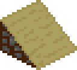

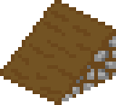

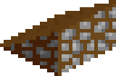

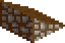

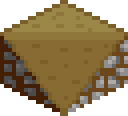

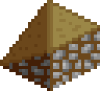

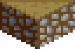

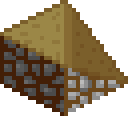

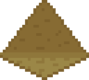

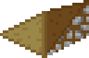

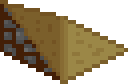

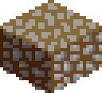
