.. _renderer-design:

==============
Renderer brief
==============

.. container:: eyebrow

   sc2k-re · renderer · design brief

.. container:: lede

   A plan for a modern C renderer for the SimCity 2000 reconstruction — **standard PNG tile atlases**, continuous zoom, the whole map on screen at once, and a hard read-only boundary against the simulation.

.. grid:: 1 1 5 5
   :gutter: 2
   :class-container: stats

   .. grid-item-card:: 1,448

      SHAPs in TSET

   .. grid-item-card:: 3

      hand-drawn zoom sets

   .. grid-item-card:: 214/256

      palette indices used

   .. grid-item-card:: 52

      SCURK packs shipped

   .. grid-item-card:: 16,384

      tiles in a full map

.. rubric:: Built so far · 31 August 2026

Phases 1 and 2 are finished. The rasteriser is pixel-exact against the
original at all three zooms.

.. grid:: 1 1 5 5
   :gutter: 2
   :class-container: stats

   .. grid-item-card:: 1448 / 1448

      shapes survive the trip out to PNG and back, pixel for pixel

   .. grid-item-card:: 6 / 6

      CRC32s agree between the C loader and the Python one

   .. grid-item-card:: byte-identical

      a city drawn from the atlas equals one drawn from the resource fork

   .. grid-item-card:: 5 / 5

      invariants hold against the city data, on cities covering all four rotations

   .. grid-item-card:: 11

      data views plus the underground view, transcribed from the game's own jump table

What retires the old format is that the renderer draws from ``assets/`` alone — the MIFF container is off the critical path — and that the result is checked against the original renderer rather than against another of ours. ``tools/shapedec.py`` keeps the two honest by decoding the tileset through the game’s own blitter; it agrees with the local codec on all 1,448.

The invariant check runs against the city data itself, not against another renderer. Two renderers agreeing is not evidence — a check can only find them disagreeing, and both can carry the same fault.

The terrain mapping, the altitude rule and the zoom geometry are read out of the game’s own tile drawing routine at :ref:`$167CC <rt-167CC>`, and the XTER table is generated into ``r_tables.c`` straight from the A5 image rather than inferred from the corpus.

Separately, the rotation question is settled: rotation *rewrites every layer* rather than remapping at draw time. Turning all 103 cities four times under ``tools/rotate.py`` returns all fifteen map layers to their original bytes. See :ref:`Crossfade the four rotations; do not promise smooth rotation <d10>`.

New files, none of them shared with the simulation: ``tools/sc2kpack.py``, the oracle set (``render_oracle``, ``render_diff``, ``render_pixels``, ``pixel_diff``, ``pixel_scan``, ``pixel_sbs``, ``blit_check``, ``shapedec``), and ``render/`` with its own ``CMakeLists.txt`` so the simulation’s build file needs no edit.

1. Where it stands
------------------

Everything needed to draw a city is already decoded. What is missing is a real-time renderer.

``tools/render.py`` is 83 lines and it already draws a correct city: it walks the map back to front along anti-diagonals, fills a flat diamond for unbuilt land, blits the ``XTER`` terrain tile, then blits the ``XBLD`` building tile if the tile carries the corner bit for the current rotation. It reads the tile art straight out of the ``TSET`` resource and the colours out of ``pltt 0``.

That script is not a prototype to be thrown away. It is the **reference image**. Every decision below has to keep producing what it produces, because it is the only thing in the project that can say whether a new renderer draws the game or draws something that looks like the game.

What the art actually is
~~~~~~~~~~~~~~~~~~~~~~~~

The tile set holds 500 logical tiles at three fixed sizes, stored interleaved as ids ``N``, ``N+500`` and ``N+1000``. Tile 0 has no picture at all — unbuilt flat land is a fill, not a blit.

.. list-table::
   :header-rows: 1
   :widths: auto

   * - Zoom set
     - Id base
     - Tiles
     - Footprint widths
     - Tallest
     - Packed area
   * - 8 px
     - 0
     - 463
     - 8 / 16 / 24 / 32
     - —
     - 92,050 px
   * - 16 px
     - 500
     - 486
     - 16 / 32 / 48 / 64
     - —
     - 323,448 px
   * - 32 px
     - 1000
     - 499
     - 32 / 64 / 96 / 128
     - 235 px
     - 1,188,208 px

The four widths are the four building footprints — 1×1, 2×2, 3×3 and 4×4. At full zoom a tile diamond is **32×16** and one altitude level is **12 pixels**, so a 31-level map is 372 pixels of relief. The tallest tile, id 1254, is 235 pixels — an arcology standing seven altitude levels above its own footprint. Anything that computes a draw bound has to allow for that overhang.

.. note::

   Checked, and worth knowing ``SPRT 129`` is *byte-identical* to the 500 tiles at base 1000 — all 499, no differences. ``SPRT 128`` covers ids 1–999, which is the 8 px and 16 px sets. The ``SPRT`` resources are the same shape data stored a second way, not a separate sprite sheet. The extractor needs one code path, not two. ``SPRT 130`` (50 shapes, ids 573–755) is the exception and does not match — treat it as an override set and find out what overrides it.

All three sets together are 1,603,706 padded pixels. Packed, they come out at **2048×1024**, **1024×512** and **512×256** — 2,752,512 pixels, which is 11 MB as premultiplied RGBA8 and 2.75 MB as 8-bit indices. The entire game’s art is three textures, and only one of them is bound at a time.

2. Two facts that decide it
---------------------------

Both were measured, not assumed. Between them they remove every reason to invent a custom asset format.

Palette index 0 is free
~~~~~~~~~~~~~~~~~~~~~~~

Across all 1,448 shapes, **no tile uses palette index 0**. The entry exists — it is white — but nothing references it. 214 of the 256 indices are in use, leaving 42 free.

That means index 0 can be reserved as the transparent colour and the whole tile set round-trips into an **indexed PNG with a tRNS chunk** with no loss and no compromise. Transparency in the MIFF format is a run type, not a colour; converting it to "index 0" is exact in both directions. The 42 free slots are headroom for mod art that wants colours the original never used.

SCURK artwork is already MIFF
~~~~~~~~~~~~~~~~~~~~~~~~~~~~~

The artwork packs in ``SCURK Artwork/`` are plain data-fork files beginning ``MIFF … SC2K``, with the same chunk layout as the ``TSET`` resource: an ``INFO`` chunk, a ``NIW_TILE`` chunk, then ``SHAP`` chunks. No resource fork, no Mac-specific container.

**33 of the 52 are readable; the other 19 are zero bytes.** Their data forks were lost somewhere in this archive’s history — a Mac file whose content lived in the resource fork, copied through something that kept only the data fork. That is an archive problem rather than a format problem, and it is worth knowing before someone spends a day debugging a decoder that is working correctly.

The 33 that survive exposed one thing the game’s own art never uses: a **span type 2**. All 645 occurrences across all 33 packs are the last span in their row with nothing after them, so it is an end-of-row marker. Handling it took one branch and moved every pack from partly decoded to fully decoded — ``Original Objects`` went from 6 shapes to 552.

So the community's mod format is a format the project can already read. Thirty years of published artwork stays loadable, and "import a SCURK object" is a feature the renderer gets nearly for free rather than a compatibility project.

3. The simulation boundary
--------------------------

The single most important thing to agree with whoever is writing the simulation, and the easiest thing to get wrong once frames and ticks are in the same process.

   Data moves one way. The simulation advances on its own fixed tick and publishes read-only snapshots; the renderer holds two and interpolates between them by the fraction of a tick elapsed. Delete the dashed path and the simulation stays reproducible no matter what the frame rate does.

The reconstruction's whole value is that it is checkable — ``oracle_diff.py`` can say the C matches the original's own code, layer by layer. A renderer that can write to ``City``, or that advances the simulation by elapsed time, destroys that. Two rules keep it:

- **The renderer takes const City and nothing else.** It owns the camera, the atlas and its own scratch buffers. It owns no game state.
- **The simulation never sees a frame time.** It advances a whole tick or none. The renderer interpolates for smoothness; the simulation does not know smoothness exists.

This is what makes moving vehicles and aircraft look modern without touching the model: keep the previous tick's positions, and draw at ``lerp(prev, cur, α)``. The original snapped things to tiles because it drew once per tick. Nothing in the data prevents drawing between ticks.

Snapshots do not have to be full copies. The layers that change every tick are small — the full-resolution layers are 128×128 bytes each, so one copy of all seven is 128 KB and a double-buffer is 256 KB. Copy them; do not build a change-tracking scheme to save a quarter of a megabyte.

4. Assets and modding
---------------------

The goal is that an artist can open one PNG in any editor, change a building, and see it in the game — with no custom tooling in the path.

.. figure:: img/fig-renderer-design-5.svg
   :alt: Three asset sources feed an offline extractor that emits an indexed PNG atlas and a JSON sidecar; the runtime loader merges mod overrides on top and uploads one GPU texture.

   The asset path. Extraction happens once, offline, in Python that already exists; the runtime only knows how to read a PNG and a JSON sidecar. A mod is a folder with a partial atlas in it — the loader composites it over the base, so nothing has to be repacked to try a change.

.. _decisions:

.. _d1:

Indexed PNG atlas plus a JSON sidecar, with a Tiled ``.tsx`` emitted alongside
~~~~~~~~~~~~~~~~~~~~~~~~~~~~~~~~~~~~~~~~~~~~~~~~~~~~~~~~~~~~~~~~~~~~~~~~~~~~~~

.. container:: eyebrow

   D1 · container format

**Take** One ``atlas.png`` per zoom set, palette-indexed with ``tRNS`` marking index 0 transparent, and one ``atlas.json`` in Aseprite's spritesheet shape.

PNG is the only image format every editor opens. Indexed PNG additionally preserves the palette, which is what SCURK artists have always worked in and what makes palette animation possible later. Aseprite's sheet JSON is the closest thing pixel art has to a standard sidecar and every tool reads it; a generated Tiled ``.tsx`` costs a few lines and gives people a free tile browser.

The sidecar carries what a PNG cannot: the tile id, source rectangle, the 1×1…4×4 footprint, the vertical anchor (``h − 16`` at full zoom, the overhang above the diamond), and any animation grouping.

.. list-table::
   :header-rows: 1
   :widths: auto

   * - Alternative
     - Why not
   * - RGBA PNG
     - Easier for newcomers, but throws away the palette and with it palette cycling, recolouring and night lighting. Offer it as ``--rgba``, not as the canonical form.
   * - Keep MIFF
     - No editor opens it. The point of the exercise is to stop needing custom tools.
   * - One PNG per tile
     - 1,448 files, and the packer has to run at load time anyway. Fine as a ``--split`` debug mode.
   * - KTX2 / compressed
     - Block compression destroys 8×5 pixel art. The atlas is 16 MB uncompressed; that is not a problem worth solving.

.. _d2:

Load SCURK packs directly, at runtime, as overrides
~~~~~~~~~~~~~~~~~~~~~~~~~~~~~~~~~~~~~~~~~~~~~~~~~~~

.. container:: eyebrow

   D2 · legacy artwork

**Take** Port the row decoder to ~150 lines of C and let a dropped SCURK file replace tiles live.

The format is small: ``MIFF``, a length, ``SC2K``, then chunks. A ``SHAP`` header is ``id, w, h, flags, datalen`` and the chunk is exactly ``10 + datalen`` bytes. Rows are ``len, tag`` then span pairs — type 3 skips, type 4 copies literal palette bytes padded to an even boundary, type 0 pads. That padding rule is the one that makes the difference between decoding and garbage.

Span type 2 ends a row; the game’s own packer never emits one, so a reader built only against ``TSET`` will decode most of a pack and silently drop the rest. The rest of the header is now pinned: across **19,113 SHAP chunks** in the game and all 33 packs, the ``flags`` word is always zero and the length field is always the chunk length minus ten, so a reader can rely on both. Being the first modern SC2K project that opens 1995 artwork without conversion is worth 150 lines.

.. _d3:

A mod is a directory of partial overrides, composited at startup
~~~~~~~~~~~~~~~~~~~~~~~~~~~~~~~~~~~~~~~~~~~~~~~~~~~~~~~~~~~~~~~~

.. container:: eyebrow

   D3 · mods

**Take** ``mods/<name>/tiles.png`` + ``tiles.json`` listing only what it changes; later entries in the load order win.

No repacking step, no build system in the artist's way. Change a PNG, restart, see it. Add a filesystem watch and drop the restart — at 16 MB the whole atlas re-uploads in a frame or two, so live reload needs no cleverness.

Keep the base atlas immutable and always composite. A mod that breaks is then removed by deleting a folder, not by reinstalling the game.

5. Smooth zoom
--------------

The original has three zoom stops. The art is drawn for exactly those three. The question is how to move continuously between them without turning crisp pixel art into mush.

   What smooth zoom actually adds. The three hand-drawn sets stop being three destinations and become three levels of detail across a continuous range — the same art, reached by a camera that can sit anywhere. Each set covers the range where it is closest to native, so nothing is ever stretched more than 1.41×; past 1× the 32 px art is magnified, which the original never offered.

.. _d4:

Antialias only across texel boundaries; keep texel interiors exact
~~~~~~~~~~~~~~~~~~~~~~~~~~~~~~~~~~~~~~~~~~~~~~~~~~~~~~~~~~~~~~~~~~

.. container:: eyebrow

   D4 · sampling

**Take** Sample the atlas with a five-line analytic filter rather than plain nearest or plain bilinear.

Nearest at fractional scale makes pixels wobble between sizes as the camera moves — the classic shimmer. Bilinear blurs art drawn at 8×5. The filter below snaps to texel centres everywhere except within one screen pixel of a texel edge, where it ramps. Interiors stay exactly as drawn; only the edges soften, by exactly as much as the scale demands.

.. code-block:: c

   // texel centres land on integers
   vec2 pix = v_uv * u_texSize - 0.5;
   vec2 f   = fract(pix);
   vec2 fw  = fwidth(pix);                      // texels per screen pixel
   f = clamp((f - 0.5) / max(fw, vec2(1e-5)) + 0.5, 0.0, 1.0);
   vec2 uv  = (floor(pix) + 0.5 + f) / u_texSize;
   vec4 c   = texture(u_atlas, uv);             // bilinear, premultiplied

Two conditions make it correct. The atlas must be **premultiplied alpha**, or every tile edge picks up a dark fringe from the transparent pixels beside it. And each tile needs a **one-pixel transparent gutter** in the atlas so neighbouring tiles never bleed into one another; extruding edge colours is the usual trick and it is the wrong one here, because these sprites are cut-outs, not tiles that abut.

.. list-table::
   :header-rows: 1
   :widths: auto

   * - Alternative
     - When it is better
   * - Offscreen at integer scale, then upscale
     - Purest result and it makes an indexed-atlas path viable, at the cost of one full-screen pass and a lot of memory at 4K. Keep as an option for people who want it exact.
   * - Plain nearest, snapped zoom
     - The retro-purist mode. Worth a toggle — some players want the original's exact look, and snapping to 1×, 2×, 3×, 4× gives it to them.
   * - Mipmaps
     - Only below 0.5×, and the hand-drawn 16 px and 8 px sets beat any mip chain generated from the 32 px art. Prefer the artist's minification to the GPU's.

.. _d5:

Treat the three art sets as LODs and crossfade at the geometric midpoints
~~~~~~~~~~~~~~~~~~~~~~~~~~~~~~~~~~~~~~~~~~~~~~~~~~~~~~~~~~~~~~~~~~~~~~~~~

.. container:: eyebrow

   D5 · level of detail

**Take** 8 px below 0.354×, 16 px from 0.354× to 0.707×, 32 px above — each with a ±10% crossfade band.

The switch points are the geometric means of the neighbouring scales, so each set is used where it is closest to native and never stretched more than about 1.4× in either direction. Crossfading over a narrow band, rather than snapping, hides the fact that the sets are not simple rescalings of each other — the 8 px art is redrawn, not reduced, and a hard cut is visible.

Crossfading means drawing the map twice inside the band. At 16,384 tiles that costs nothing, and the band is a few percent of the zoom range.

Altitude has to scale with the set: 12 pixels per level at 32 px, 6 at 16 px, 3 at 8 px. Keep the camera in continuous world units and derive pixel offsets, rather than carrying three integer constants around.

.. _d6:

Resolve to RGBA at load; keep the indices only for the tiles that animate
~~~~~~~~~~~~~~~~~~~~~~~~~~~~~~~~~~~~~~~~~~~~~~~~~~~~~~~~~~~~~~~~~~~~~~~~~

.. container:: eyebrow

   D6 · palette on the GPU

**Take** A premultiplied RGBA atlas as the fast path, plus a retained index copy of the handful of palette-cycled tiles.

Indices cannot be filtered — interpolating between palette index 40 and 44 is meaningless — so a fully indexed atlas and the smooth-zoom filter are in direct conflict. Resolving the palette on the CPU at load sidesteps it entirely.

What is worth keeping is the ability to *re-resolve*. Water shimmer in games of this era is palette cycling, and re-resolving twenty water tiles on a cycle is microseconds. The same mechanism gives a day/night tint and mod-supplied palette variants: ship several 256-entry palettes, blend between them, re-resolve. That is a genuine modern convenience the original could not have, and it costs one extra array.

6. Draw order and render distance
---------------------------------

The surprise here is how small the problem is. A SimCity 2000 map is 128×128. It was a lot for a 1994 Macintosh and it is nothing now.

.. _d7:

There is no render distance. Draw the whole map, every frame
~~~~~~~~~~~~~~~~~~~~~~~~~~~~~~~~~~~~~~~~~~~~~~~~~~~~~~~~~~~~

.. container:: eyebrow

   D7 · render distance

**Take** Build one instance buffer for all 16,384 tiles, rebuild it on change, and stop thinking about culling.

At full zoom the entire city is **4,096 pixels wide and roughly 2,600 tall** including 372 pixels of altitude relief and the tallest building's overhang. That is smaller than a 4K display. The original clipped to a 640×480 window because of fill rate on a 68k Mac, not because of anything in the data.

Worst case is about four quads per tile — ground, terrain, building, overlay — so 65,000 quads and a 2 MB instance buffer. One draw call, one texture bind. "Increased rendering distance" is not a feature to build; it is what happens when the clip is removed.

Frustum culling in isometric space is four lines if profiling ever asks for it. Do not write it first.

.. _d8:

Keep the anti-diagonal painter's sweep; cache its output
~~~~~~~~~~~~~~~~~~~~~~~~~~~~~~~~~~~~~~~~~~~~~~~~~~~~~~~~

.. container:: eyebrow

   D8 · ordering

**Take** The order ``render.py`` already uses, emitted once into a vertex buffer and reused until a tile changes.

A depth buffer looks tempting and is a trap. Multi-tile buildings are drawn once, at whichever corner the rotation's mask selects, but they occupy up to sixteen tiles' worth of depth; a single depth per quad cannot express that, and per-fragment depth costs more than the sort it replaces. Sorting 16,384 tiles is a sweep over anti-diagonals with no comparisons in it at all — the order is arithmetic, not a sort.

Because the order is fixed by geometry, it only changes when the map does. Rebuild dirty rows on a tile edit; rebuild everything on load or rotate. The frame itself does no ordering work.

Draw order per tile, extending what the original does:

#. Ground — the flat diamond fill, or the ``XTER`` terrain tile.
#. Underground — ``XUND`` pipes, subway and tunnels, in the underground views only.
#. Building — ``XBLD``, gated on the ``XZON`` corner bit for the current rotation.
#. Moving things — ``XTHG``, positions interpolated between ticks.
#. Data overlay — the heat maps, blended in isometric space.
#. Signs and labels — ``XTXT``, then the interface.

.. _d9:

Upload the data layers as textures and blend them in a shader
~~~~~~~~~~~~~~~~~~~~~~~~~~~~~~~~~~~~~~~~~~~~~~~~~~~~~~~~~~~~~

.. container:: eyebrow

   D9 · data overlays

**Take** ``xtrf``, ``xplt``, ``xval``, ``xcrm`` as 64×64 ``R8``; ``xplc``, ``xfir``, ``xpop``, ``xrog`` as 32×32 ``R8``.

Eight textures totalling 20 KB. The shader samples the layer at the tile's map position and blends a ramp over the scene. Switching overlays becomes a uniform change, so they can fade in and out, be shown at partial strength over the normal view, or two at once — none of which the original could do, and none of which costs a redraw.

Sampling these bilinearly gives smooth gradients across the half- and quarter-resolution grids. That is a real improvement over the original's blocky 2×2 and 4×4 patches, and it changes nothing about the numbers underneath.

.. _d10:

Crossfade the four rotations; do not promise smooth rotation
~~~~~~~~~~~~~~~~~~~~~~~~~~~~~~~~~~~~~~~~~~~~~~~~~~~~~~~~~~~~

.. container:: eyebrow

   D10 · rotation

**Take** A short camera swing plus a crossfade between the two states, roughly 250 ms — over a *full* rebuild, because rotating is not a camera operation at all.

**Rotation rewrites the map.** :ref:`$3AECA <rt-3AECA>` turns all seven full-resolution layers, all eight data layers and every ``XTHG`` record through 90° in place, and only then bumps the rotation counter. The geometry, read off the four stores in the ring loop, is ``new[y][x] = old[N-1-x][y]``. So the arrays in a save file are already in whichever of the four orientations the city was left in; there is no canonical north.

Three of the layers pass every byte through a translation table on the way, because their ids encode a direction — ``XBLD`` through ``A5-0xEE2``, ``XTER`` through ``A5-0xDE2``, ``XUND`` through ``A5-0xD9C``. The ``XBLD`` table is a clean permutation: 176 ids fixed, 12 two-cycles for tiles with two orientations, 14 four-cycles for tiles with four. Composing any of the three four times is the identity on every value that occurs in the 103 shipped cities.

Two consequences for the renderer, and they pull in opposite directions. **Drawing gets simpler:** ``XBLD`` already holds the correctly-oriented tile id, so there is no rotation-aware lookup at draw time and no per-rotation id remap — the thing the instance buffer would have had to carry. **Rotating gets more expensive:** every layer changes, so the whole buffer is rebuilt, and a crossfade has to hold two complete built states at once. At 2 MB a buffer that is a fine trade.

It also explains the rotation-indexed ``ROT_CORNER_MASK``. ``XZON`` moves as a plain byte — no table — so the array turns underneath its corner nibble while the corner bits stay put. The mask is the compensation.

Smooth rotation remains out of reach: there is no art for the intermediate angles, and generating it would mean redrawing the game. A crossfade with a slight camera arc reads as modern and needs no new pixels.

7. The stack
------------

"Rooted in C, within reason" — which means C99 to match the simulation, few dependencies, and each one carrying real weight.

.. list-table::
   :header-rows: 1
   :widths: auto

   * - Layer
     - Choice
     - Why, and the alternative
   * - window, input, audio
     - SDL3
     - One C dependency covering every platform. Nothing else is close.
   * - graphics
     - SDL_GPU
     - Modern backends behind a C API, already in SDL3, so no second dependency. **sokol_gfx** is the conservative alternative — single header, longer track record. Either way, shaders need an offline cross-compile step (``SDL_shadercross`` or ``sokol-shdc``); budget for it rather than discovering it.
   * - PNG
     - lodepng
     - Single ``.c``/``.h``, MIT, and — unlike ``stb_image`` — it can hand back raw palette indices, which the atlas format and the palette decision both need.
   * - reference path
     - software rasteriser
     - Not optional. See below.
   * - interface
     - deferred
     - Nuklear or microui if it must be C; Dear ImGui if C++ is acceptable for the interface alone. Decide after the map draws.

The software path is the point, not a fallback
~~~~~~~~~~~~~~~~~~~~~~~~~~~~~~~~~~~~~~~~~~~~~~

This project's discipline is that claims are checked. The brief says a number without a denominator is not a result, and that a routine should be run rather than read. A renderer deserves the same treatment, and it can have it: **a software rasteriser that reproduces render.py's PNG exactly**, byte for byte, at 1× and rotation 0.

That gives a regression test with no tolerance in it, on a path with no driver and no shader compiler. The GPU path is then checked against the same image within a small tolerance, and a difference is a bug in one of two places rather than a matter of opinion. It also means the project can render a city in continuous integration, on a machine with no display.

Module layout
~~~~~~~~~~~~~

::

   sim/
     render/
       r_atlas.c    atlas + sidecar load, mod overrides, palette resolve
       r_miff.c     MIFF/TSET/SPRT reader — SCURK import at runtime
       r_camera.c   iso projection, continuous zoom, pan, rotation state
       r_scene.c    const City * -> instance buffer; dirty-region rebuild
       r_gpu.c      SDL_GPU backend, one pipeline, one bind
       r_soft.c     reference rasteriser; must match render.py exactly
       r_overlay.c  data-layer textures and ramps
   tools/
       sc2kpack.py  extract / pack / import-scurk — builds on miff.py

Extraction stays in Python. ``miff.py`` already decodes the format correctly, including the odd-run padding rule that took real effort to find, and it runs once at build time. The C runtime only needs to read PNG — plus ``r_miff.c`` for the live SCURK import, which is the one place the format has to exist in both languages.

8. Cross-platform, enforced
---------------------------

A portability rule that is only written down is a rule that drifts. Each one below is enforced by the build or by a test, so breaking it fails here rather than on someone else’s machine.

.. list-table::
   :header-rows: 1
   :widths: auto

   * - Rule
     - How it is enforced
     - What it prevents
   * - C99, no compiler extensions
     - CMAKE_C_EXTENSIONS OFF
     - Gives ``-std=c99`` rather than ``-std=gnu99``, so a POSIX-only call — ``strdup``, ``strcasecmp``, ``<unistd.h>`` — fails to compile on the developer’s own machine.
   * - Strict warnings on our code only
     - sc2k_warnings
     - An interface target carrying ``-Wconversion`` and friends. A silent narrowing in a renderer is an off-by-one on someone’s screen.
   * - Vendored headers are invisible
     - SYSTEM include dir
     - jsmn is header-only and compiles into our translation unit; without this its 18 warnings arrive wearing our strict flags and hide ours.
   * - No hardcoded paths
     - CMakePresets.json
     - Presets for debug, release, a sanitiser build and MSVC configure with no edits on any of the three platforms.

Rules the code keeps
~~~~~~~~~~~~~~~~~~~~

- **Fixed-width types only.** ``long`` is 32 bits on Win64 and 64 everywhere else, so it cannot hold anything written down or compared across machines.
- **Binary mode on every fopen.** A text-mode read on Windows eats ``\r``, and every offset after the first newline is wrong.
- **Never cast a struct over a byte buffer.** The game’s data is big-endian. Read it a byte at a time and shift — no ``#pragma pack``, no assumptions about padding.
- **No variable-length arrays** (MSVC has none), and **uint8_t for data bytes, never char**, whose signedness differs between x86 and ARM.

And rules the asset pipeline keeps
~~~~~~~~~~~~~~~~~~~~~~~~~~~~~~~~~~

``sc2kpack.py`` has to run wherever the game builds, so it uses the standard library and nothing else — no Pillow, no numpy. The PNG codec is written out in the tool in both directions, which is 120 lines and removes a dependency that would otherwise have to exist on three platforms. Every text write names its encoding and its newline explicitly, so a sidecar written on Windows is byte-identical to one written on Linux. It targets Python 3.9, which is what the system Python here is.

The tests that hold it together
~~~~~~~~~~~~~~~~~~~~~~~~~~~~~~~

.. code-block:: console

   python3 tools/sc2kpack.py verify         shapes round-trip through our own codec
   ctest --test-dir render/build/...  atlas loads; blit_check; invariants
   python3 tools/blit_check.py             our blit() vs $18E96, both mirrors
   python3 tools/render_diff.py  CITY      our blit list vs the game's
   python3 tools/pixel_diff.py   CITY      PIXELS vs the game's own renderer

The first two compare this project against itself and can only find internal disagreement; the last three run the original. Which check can see which stage of the pipeline — and the two ways a check can lie about it — is set out in `How SC2K Draws a Frame <https://claude.ai/code/artifact/4305c1c2-353c-453b-8bca-503354774f89>`__, which is the reference for the original’s behaviour. This brief covers the reconstruction’s design; it does not restate the pipeline.

9. Open questions
-----------------

Things this brief assumes and should not. Each is answerable from the disassembly or from a short experiment, and each changes a decision above if it comes out the other way.

.. list-table::
   :header-rows: 1
   :widths: auto

   * - Question
     - Why it matters
     - Where to look
   * - What is the 8-byte shape descriptor array at ``$1226(a5)``? **Answered.** It is a *pointer* table, allocated by ``_NewPtr(0x2EE0)`` at ``$018CFE`` — which is why it is in no resource on disk. :ref:`$18EB4 <rt-18EB4>` reads +0 as the pointer to the sprite’s span stream, and :ref:`$18EC4 <rt-18EC4>`/:ref:`$18ECE <rt-18ECE>` add +4 and +6 to y and x to build the clip rect, so those two fields are simply the sprite’s height and width. A caller therefore passes the art’s top-left, and :ref:`$16298 <rt-16298>`’s subtraction is the sprite’s full height.
     - Indexed by ``500*zoom + shape``; offset +4 is a Y anchor the renderer currently derives from the art’s own height instead. Reading it replaces a guess with the game’s own number.
     - ``$16894`` to ``$1689C``
   * - Which tile does an ``XTHG`` record draw?
     - The record layout is now partly known — type at +0, heading at +1, y at +3, x at +4, twelve bytes each — but not which art a given type selects. Sprite interpolation has positions now; it still has no pictures.
     - ``$3B96E`` arms, SPRT 130's 50 shapes
   * - What is ``SPRT 130``?
     - 50 shapes at ids 573–755 that do *not* match TSET. An override set, an animation set, or a 1.2 patch — it changes what the extractor emits.
     - diff against TSET 500-base
   * - Which tiles are palette-cycled?
     - The palette decision keeps index data only for these. If the answer is "none", the indexed path is optional rather than useful.
     - the water tiles; any per-frame palette write
   * - How are ``XTXT``, ``XLAB`` and ``XMIC`` laid out?
     - Signs and labels are draw-order step 6 and nothing here knows their structure yet.
     - sc2.py chunk readers

10. A build order
-----------------

Ordered so that something is verifiable at the end of every step, and so the asset work lands before the graphics work depends on it.

Extractor and round-trip
~~~~~~~~~~~~~~~~~~~~~~~~

.. container:: eyebrow

   Step 1 · done

``sc2kpack.py`` emits the three indexed atlases plus sidecars, reads them back, and re-encodes to MIFF. All 1,448 shapes round-trip pixel for pixel — the same standard the RLE codec is already held to. It also imports SCURK packs and can write one, so art edited as a PNG here can be loaded by the 1995 game.

Software rasteriser
~~~~~~~~~~~~~~~~~~~

.. container:: eyebrow

   Step 2 · done

``r_soft.c`` draws a city from a read-only view, with no GPU in the picture. It matches ``render.py`` pixel for pixel on cities covering all four rotations. The view type is ``RCity``, defined in the renderer and deliberately *not* the simulation's ``City`` — an adapter will fill one from the other, and until then ``r_city.c`` reads a ``.SC2`` directly so the renderer builds and tests standalone.

Window and GPU path
~~~~~~~~~~~~~~~~~~~

.. container:: eyebrow

   Step 3 · done

SDL3 with SDL_GPU, one atlas bind per art set, the sweep's op list as an instance buffer. Draws the same city at 1× and matches the software output exactly at 32 and 8 px, within ten pixels at 16 px; pan and integer zoom. See :doc:`enhanced-renderer`.

Continuous zoom
~~~~~~~~~~~~~~~

.. container:: eyebrow

   Step 4 · built, without the crossfade

The level-of-detail ladder of D5 and the texel-boundary sampler of D4, 1 September 2026: the camera carries one continuous scale, the set nearest native draws the canvas, and the resolve pass scales it by the remainder with the D4 filter at fractional scales and plain nearest at integer ones, which keeps the identity check exact. The canvas is drawn at the window's resolution with the camera scaled, so sprites magnify by nearest and the mesh and water are crisp; the D4 sampler for sprites at fractional scales, which needs the palette resolved to colours first, and the ±10% crossfade band are not built: the set switches at the geometric midpoints. See :doc:`enhanced-renderer`.

Overlays and interpolation
~~~~~~~~~~~~~~~~~~~~~~~~~~

.. container:: eyebrow

   Step 5 · not started

The eight data-layer textures with fades, then the fixed-tick snapshot pair and interpolated moving things. Answer the XTHG question first.

Mods and SCURK
~~~~~~~~~~~~~~

.. container:: eyebrow

   Step 6 · not started

``r_miff.c``, the mod override directory, live reload. Load all 33 readable packs as the test — a renderer that opens 1995 artwork untouched is the thing worth showing people.

11. The third dimension
-----------------------

The grid keeps every constraint the 1995 game puts on it — 128×128 tiles, the same layers, the same altitudes, the same rules about what may stand where. What changes is that the grid stops being a stack of pre-drawn diamonds and becomes real geometry: an isometric view of a surface that can be deformed, lit and moved through, rather than a picture of one.

Two decisions above are made *on the assumption that the renderer is a sprite compositor*, and this direction overturns both. They are worth naming rather than quietly dropping.

.. admonition:: “Crossfade the four rotations; do not promise smooth rotation.”
   :class: caution

   Rotation is not a camera operation in the original: ``$3AECA`` rewrites all seven layers in place and passes XBLD, XTER and XUND through directional remap tables, because their ids encode a direction. A heightfield has no such problem — terrain can rotate to any angle. Direction-encoded sprites still cannot. So the constraint does not disappear, it relocates: the ground becomes free and the buildings become the thing that has only four orientations.

.. admonition:: “A depth buffer looks tempting and is a trap.”
   :class: caution

   The objection is exact for billboards: a multi-tile building is drawn once but occupies up to sixteen tiles’ worth of depth, and one depth per quad cannot express that. It stops applying the moment a building is geometry rather than a quad. Which way that goes is a real choice, not an oversight — see the open decisions below.

The foundation is already documented
~~~~~~~~~~~~~~~~~~~~~~~~~~~~~~~~~~~~

A surface needs the height of each of a tile’s four corners, and the game states it. ``fixTerrain`` (:ref:`$128DE <rt-128DE>`) derives a tile’s shape from its eight neighbours: each one standing higher lifts the corners it touches, through the table at ``A5-0x4DF6``, and the resulting four-bit mask indexes ``A5-0x4DEE`` to give the code stored in XTER. So XTER *is* a corner mask, in three bands — dry, shore, deep. `SimCity 2000 Mechanics <https://claude.ai/code/artifact/35441901-6883-45dc-9836-74a957825e8e#slopes>`__ sets this out in full, with the fourteen codes drawn.

The derivation itself is in the reconstruction: ``src/sim/sim.c`` carries ``fixTerrain`` with both tables, and ``tools/terrain_check.py`` holds it exact against the original, 90,745 of 90,745 values on five cities, with ``fixNeighbourhood`` at 90,166 of 90,166.

Two consequences decide how the mesh is built. **ALTM is the tile’s lowest corner, not its centre** — corners are only ever lifted, never lowered, so a tile’s surface spans exactly ``[alt, alt+1]`` and every corner height is an integer. And **a pit cannot exist**: mask 15, all four corners higher, is not a shape but the instruction to raise the tile and start again. The heightfield is therefore fully determined by ALTM plus four bits per tile, with no half-levels anywhere.

Two mechanisms have no third-dimensional meaning at all
~~~~~~~~~~~~~~~~~~~~~~~~~~~~~~~~~~~~~~~~~~~~~~~~~~~~~~~

Both of the blitters that read the screen exist *because* the original is compositing in 2D, and neither survives the move:

.. list-table::
   :header-rows: 1
   :widths: auto

   * - In the original
     - In three dimensions
   * - :ref:`$19004 <rt-19004>` stencils a car onto index 0x91, so a power line or a building already covering the road erases it
     - the car is an object on the road surface and occlusion falls out of the depth buffer — the stencil was a way to fake exactly this
   * - :ref:`$19B76 <rt-19B76>` darkens destination indices 100..110, for thing types 1, 2 and 16 only
     - a real shadow, cast by the same three types if the look is to be kept

Reading them that way is the argument *for* the move: both are 1995 workarounds for not having a depth buffer, and neither is visible to a blit list.

Decided: snapped to the original isometric, exactly
~~~~~~~~~~~~~~~~~~~~~~~~~~~~~~~~~~~~~~~~~~~~~~~~~~~

The camera keeps the four orientations. Not as a limitation to be lifted later but as a *requirement*, and a strict one: the 3D view at each snap angle must land on the same screen coordinates as the sprite renderer, so that **the original tileset can be superimposed on the geometry as-is**. Free rotation stays a future possibility and nothing should be built that forecloses it — but it is not the target now.

That requirement is worth more than it costs, because it hands back the thing that looked lost. A 3D renderer cannot be diffed against the original — the original cannot draw it. A 3D renderer *whose projection is exact* can: the mesh silhouette and the sprite silhouette have to agree, pixel for pixel, on the same 30 cities already verified. The oracle survives the move.

.. admonition:: The projection is not a cube’s
   :class: caution

   One altitude level is 12 px against a 16 px tile height — and 6 against 8, and 3 against 4 — a consistent **0.75**, and an artistic choice rather than the geometrically correct isometric height. A world built from unit cubes and projected “properly” will be close enough to look right and wrong enough that nothing lines up. The vertical scale is a constant to be honoured, not derived.

Decided: terrain sculpting, through a signed distance field
~~~~~~~~~~~~~~~~~~~~~~~~~~~~~~~~~~~~~~~~~~~~~~~~~~~~~~~~~~~

The deformation the original had — raise, lower, level — kept, with far more flexibility in how it is expressed. The intended representation is an SDF the surface is meshed from, rather than a heightfield edited in place.

The crux is the round trip, and it should be designed first rather than discovered. **The grid stays the truth.** The simulation reads XTER and ALTM and nothing else, so any sculpt has to resolve back to a legal (XTER, ALTM) pair or the render and the model quietly diverge — which is exactly the failure this project has spent its whole life avoiding. Two operators, and they must compose to the identity:

- **grid → field.** The canonical embedding. At rest it has to reproduce the discrete stepped terrain exactly, or superimposition fails on the first frame.
- **field → grid.** The projection back onto the nearest legal state — legal meaning one of the fourteen slope shapes, with the altitude rules the original enforced. This is where “more flexibility” has to stop being flexible.

.. admonition:: Worth settling early
   :class: note

   A full volumetric SDF buys overhangs and caves. The grid cannot express either — tunnels are XUND, a separate layer — so that geometry could never round-trip to the simulation. If the goal is smooth sculpting of a surface, a heightfield with a distance-field *brush* model gets the interaction and the smoothness at a fraction of the cost. Volumetric earns its keep only if terrain that the simulation cannot represent is wanted anyway, as decoration.

What stays exactly as it is
~~~~~~~~~~~~~~~~~~~~~~~~~~~

The pixel-exact 2D path does not become obsolete; it becomes the reference. The *derivations* get checked against data — corner heights by adjacency, anchors and footprints against blit lists that are already exact — and the 2D renderer stays the regression oracle it has become. With the projection pinned, the 3D path is checkable against it directly rather than only in the abstract.
