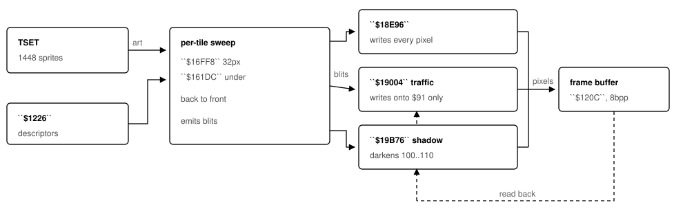

.. _rendering-pipeline:

==========================
How the game draws a frame
==========================

.. container:: eyebrow

   SimCity 2000 · Mac 68k · reverse engineering

The rendering pipeline as the 1995 binary actually implements it, from the art in the resource fork to the bytes in the frame buffer — with the address of every rule, and an honest account of which parts of the reconstruction are verified against the original and which are not.

Overview
--------

Three blitters, two of which read the screen
~~~~~~~~~~~~~~~~~~~~~~~~~~~~~~~~~~~~~~~~~~~~

SC2K draws the map back to front along anti-diagonals, one tile at a time, and every visible pixel goes through software. There is no QuickDraw in the hot path: the blitters use no toolbox traps at all, which is what makes the original renderable under an emulator and therefore usable as an oracle.

What matters is that there is not one blitter but three, and only the first is a plain write. :ref:`$19004 <rt-19004>` draws traffic and writes a pixel *only where the destination is already index 0x91*, the road surface; :ref:`$19B76 <rt-19B76>` draws shadows by rewriting the destination without consulting the source at all. Both are invisible to any check that records which shapes get drawn, because the blit list is identical either way — only the write differs.

   The path a pixel takes. The dashed bus is what a blit-list oracle cannot see: a traffic car is stencilled onto asphalt rather than layered over it, so a power line or a building already covering the road erases the car underneath, and the shadow rewrites whatever it lands on. Palette animation touches none of this — it moves the colour table only.

Stage one
---------

Where the art lives
~~~~~~~~~~~~~~~~~~~

All the tile art is in one resource: ``TSET 128``, “Default Complete Tileset”, 989 KB in the application’s resource fork. It holds 1,448 ``SHAP`` chunks, each a 10-byte header (``id, w, h, flags, dataLen``) followed by an RLE span stream.

Shapes are numbered ``500 × zoom + tile``: 0–499 is the 8 px art, 500–999 the 16 px, 1000–1499 the 32 px. A renderer picks its base from the zoom and adds the tile number, which is why nearly every shape id in the listing appears as ``d3 + n``.

The span types are the same for every sprite: 3 skips *n* pixels, 4 copies *n* literal bytes padded to an even boundary, 0 is padding, and 2 ends a row — written only by SCURK, never by Maxis’s own packer.

Stage two
---------

The shape descriptor table at ``$1226``
~~~~~~~~~~~~~~~~~~~~~~~~~~~~~~~~~~~~~~~

This cost more time than anything else in the project, because its contents are not on disk anywhere. ``$018CFE`` allocates it with ``_NewPtr(0x2EE0)`` — 1,500 entries of 8 bytes — and it is filled at load. Its layout is readable straight off the blitter:

.. code-block:: m68k

   018EAE  a3 = $1226(a5) + shape*8
   018EB4  a2 = (a3)          ; +0 -> the sprite's span stream
   018EB8  if !a2 -> exit     ; a null entry draws nothing
   018EC4  d0 = $4(a3) + d3   ; +4 ADDED to y
   018ECE  d0 = $6(a3) + d4   ; +6 ADDED to x
   018EDC  ...compared against the clip rect

So it is a **pointer table**, and ``+4``/``+6`` are simply the sprite’s height and width, used to build the destination rectangle. Two consequences follow, and both matter:

- The y a caller passes is the art’s **top-left**, not a baseline. :ref:`$16298 <rt-16298>`’s ``sub.w $4(a0,d0.l), d1`` is therefore subtracting the sprite’s full height.
- There is no separate “footprint drop” for large buildings. A taller sprite reaches further down because its height is subtracted; that is the entire mechanism.

Stage three
-----------

One tile, in order
~~~~~~~~~~~~~~~~~~

:ref:`$15490 <rt-15490>` picks a per-zoom renderer and the sweep walks tiles back to front along anti-diagonals. Each tile emits its shapes in a fixed order; get the order wrong and a thing is painted over by the network it stands on.

There are **three** surface renderers, one per zoom, and they are separate code: :ref:`$16B74 <rt-16B74>` drives :ref:`$16FF8 <rt-16FF8>` at 32 px, :ref:`$17978 <rt-17978>` drives :ref:`$17A6C <rt-17A6C>` at 16, and :ref:`$183F2 <rt-183F2>` drives :ref:`$184DC <rt-184DC>` at 8. All three have the same two-pass shape — adjust the clip rect on entry, then diagonals from row 0, then diagonals from column 127 — but each carries its own constants and its own copy of the per-tile order. The underground and data-view renderers, by contrast, are zoom-generic: they build ``2<<zoom``, ``3<<zoom`` and ``4<<zoom`` in their own prologues, so one driver serves every size.

Being separate code, they do not agree. The 8 px renderer draws markedly less ground than the other two, and the differences are rules, not rounding:

.. list-table::
   :header-rows: 1
   :widths: auto

   * - Address
     - At 8 px
     - At 16 and 32 px
   * - ``$186BA``
     - the ground pass runs only for ``XBLD < 0x1D``
     - ground goes under everything below 0x70
   * - ``$188F4``
     - a network gets ground only when ``XTER == 13`` — the case that also lifts it one altitude step
     - ground always
   * - ``$187FC``
     - an elevated piece (XBLD 0x61–0x6B) is blitted with no footprint ground at all
     - all four tiles of the footprint are laid first

None of this is visible at 32 px, where the art covers the whole diamond and an extra ground pass underneath changes no pixel. At 8 px a few edge pixels are transparent and it shows. Reconstructing one zoom and assuming the others match is wrong in both directions.

.. admonition:: One asymmetry that is the game’s, not a defect
   :class: note

   At 8 px the renderer blits car sprites 427–449, which do not exist in TSET. ``$18EB8`` exits on the null art pointer, so the call draws nothing. A reconstruction that skips them produces identical pixels; only the blit list differs.

.. list-table::
   :header-rows: 1
   :widths: auto

   * - Address
     - What it draws
     - Condition
   * - ``$17018``
     - the map-edge skirt: dirt cliff, then water faces stacking upward
     - only ``row == 127 || col == 127``
   * - ``$17192``
     - an empty zoned lot, shape 290 + zone
     - no building, no terrain, zoned
   * - ``$1753C``
     - terrain, from the XTER table at ``A5-0x493E``
     - suppressed under a zone building
   * - ``$17528``
     - the network, one altitude step up on XTER 13
     - ``moveq #$f4`` is −12, not +244; the ELEVATED branch has no such test
   * - ``$17612``
     - traffic, from the XTRF density layer
     - lower thresholds for highway and elevated
   * - ``$17514`` / ``$17704``
     - the car itself — two different blitters
     - elevated uses ``$18E96``, road uses ``$19004``
   * - ``$172B6``
     - the no-power marker, tile 386, stamped over the tile
     - ``XBIT & 0xC0 == 0x80``: conducts, unsupplied
   * - ``$FABA``
     - things — aircraft, boats, trains — and their shadows
     - runs LAST, so a train draws over its track
   * - ``$FAD0``
     - which thing: ``XTXT[row][col]``, not a scan of XTHG
     - 0xC9..0xF0 is the thing index plus 0xC9

The no-power marker is worth singling out, because it is the one rule in this table that a 32 px test can miss entirely. Three branches reach the tile renderer’s common exit at :ref:`$17948 <rt-17948>`, and each checks whether the tile conducts power (XBIT bit 7) without being supplied (bit 6 clear); if so it stamps tile 386 at ``x − tile_w/2 + width/2``, ``y − tile_w/2``, using the *tile’s* y rather than the network’s and passing it straight to the blitter — so it is a top-left and the sprite’s height is not subtracted. It went unnoticed until the 16 px and 8 px renderers were driven for the first time, purely because more map fits in frame at those sizes and the 32 px crops never happened to contain an unpowered conductive tile.

A tile knows which thing stands on it because the **XTXT layer says so**. :ref:`$FABA <rt-FABA>` reads ``XTXT[row][col]`` and branches on the value: below 0x33 and at 0xFA it is a sign or label (:ref:`$FB32 <rt-FB32>`), 0xC9–0xF0 is a thing whose index is the value less 0xC9 (:ref:`$FB18 <rt-FB18>`), 0xF1–0xFA draws nothing, and 0xFB and above go to :ref:`$399D8 <rt-399D8>`. Reconstructing that association by scanning XTHG and trusting the row and column stored in each record looks equivalent and is not: it puts things on tiles the game leaves empty.

The underground view (:ref:`$161DC <rt-161DC>`) is a different renderer with its own order: a tunnel marker from ``ALTM >> 10``, then pipe or subway, then a water-status marker, then the wireframe lattice — which is reached only when nothing is buried and there is no water network, so it is the empty-tile art rather than a backdrop. Finally XBLD, which below 14 draws nothing and at 0x70 and above collapses to one generic zone marker.

.. admonition:: The anchor trap
   :class: caution

   Every underground overlay shares one y, computed once at ``$16298`` from the ground sprite. Anchoring each overlay on its own art instead puts a 34 px tunnel 18 px up and the 26 px piece beside it only 10 — an 8 px step that shears every join apart.

Stage four
----------

The blitter
~~~~~~~~~~~

:ref:`$18E96 <rt-18E96>` is a dispatcher. It reads the descriptor, builds the destination rect, culls against the clip rectangle in ``$1212``/:ref:`$1214 <rt-1214>`/:ref:`$1216 <rt-1216>`/:ref:`$1218 <rt-1218>` (top, left, bottom, right), and hands off to one of six inner routines:

.. list-table::
   :header-rows: 1
   :widths: auto

   * - Routine
     - When
   * - ``$19238`` / ``$192EE``
     - plain — unclipped / clipped
   * - ``$19498`` / ``$1952C``
     - mirrored; x is offset by the sprite width first
   * - ``$19634`` / ``$196E4``
     - the third mode, selected by ``$10(a6)``

The inner routines write 8 bits per pixel into ``$120C(a5)`` with ``$1210(a5)`` as rowBytes. The mirror argument is only ever tested (:ref:`$18F10 <rt-18F10>`), never used as a value, so any non-zero means mirrored — :ref:`$16722 <rt-16722>` passes ``XBIT & 2``, which is 2.

.. admonition:: A calling-convention trap
   :class: caution

   Callers push clr.l for the mirror argument, so both $e(a6) and $10(a6) are parameters, and ``$18F08`` tests $10 first. Pushing only four words leaves it uninitialised, which sends a sprite down the mirrored-clipped path and into a

   _Debugger trap.

Stage four and a half
---------------------

The traffic blitter
~~~~~~~~~~~~~~~~~~~

Cars do not use :ref:`$18E96 <rt-18E96>` at all. Every one of the five call sites — :ref:`$17704 <rt-17704>`, :ref:`$17F8A <rt-17F8A>`, :ref:`$18172 <rt-18172>`, :ref:`$188E8 <rt-188E8>`, :ref:`$18A8C <rt-18A8C>`, which is the three zoom levels — calls :ref:`$19004 <rt-19004>`, a second dispatcher with its own four inner routines. Each of them does this:

.. code-block:: m68k

   01987C  move.b (a2), d0    ; read the DESTINATION pixel
   01987E  cmpi.w #$91, d0    ; is it the road surface?
   019882  bne.b  $19886      ; no -- drop this source pixel
   019884  move.b (a3), (a2)  ; yes -- write the car

A car is *stencilled onto asphalt*, not layered over it. Wherever a power line, a building, a bridge rail or a tree already covers the road, the car pixel is discarded — which is how the game gets correct occlusion for traffic without any depth information or any second pass. Index 0x91 is (143, 143, 143), the road grey.

.. admonition:: Not every car takes this path
   :class: caution

   There are two car-drawing blocks in the 32 px renderer.

   ``$17704`` is the stencilled one, used for roads and surface highways; ``$17514`` handles the elevated pieces (XBLD 0x61–0x6B) and uses the plain ``$18E96``

   . That has to be so: an elevated deck is not asphalt, so stencilling against 0x91 up there would delete every car on the highway.

   The split is 32 px only — at 16 and 8 px both car sites go to ``$19004``; ``$188E8`` sits directly after the 8 px elevated test at ``$187EC`` and still stencils.

Stage five
----------

The shadow, and why it hides
~~~~~~~~~~~~~~~~~~~~~~~~~~~~

:ref:`$A032 <rt-A032>` draws a thing, and before the sprite it draws a shadow — same shape, same x, dropped onto the ground:

.. code-block:: m68k

   00A370  cmpi.w #$2, d7     ; thing type: only 1, 2 and 16 cast one
   00A396  cmpi.w #$70, d0    ; XBLD under the thing; a zone building -> no shadow
   00A3A4  d0 = thing altitude
   00A3A8  subq.w #$2, d0
   00A3AA  muls.w -$8(a6), d0 ; x (2<<zoom)
   00A3AE  add.w  d3, d0      ; + the sprite's y
   00A3B8  jsr $1911E

And :ref:`$19B76 <rt-19B76>`, which does the work, is not a blit at all:

.. code-block:: m68k

   019BE2  cmpi.b #$4F, (a2)  ; 79 is its own case...
   019BE8  move.b #$54, (a2)  ; ...and becomes 84
   019BF2  cmpi.w #$64, d0    ; destination below 100 -- leave it
   019BFC  cmpi.w #$6E, d0    ; above 110 -- leave it
   019C02  move.b #$6E, (a2)  ; otherwise darken to 110

The allow-list at :ref:`$A370 <rt-A370>` matters as much as the darkening rule: types 1, 2 and 16 are the things that fly, and they are the only ones that cast a shadow. A boat or a train falls straight through to :ref:`$A3C0 <rt-A3C0>` and is drawn with none. Reading that test as an exclusion instead put shadows under every boat in Charleston.

It walks the sprite’s silhouette but reads the destination and only rewrites pixels already in the dirt ramp, so it darkens open ground and does nothing to roads, water or rooftops. A reconstruction working in RGB cannot implement it faithfully: index 104 shares its RGB with three entries in the animated range, so the frame buffer has to carry palette indices as well as colour.

Stage six
---------

Animation is a palette permutation
~~~~~~~~~~~~~~~~~~~~~~~~~~~~~~~~~~

The art is completely static. Water shimmer, blinking rooftop lights and traffic signals are all the palette moving under fixed pixels — runs 155–203 and 224–238, handed to ``_AnimatePalette`` as ``(srcIndex 0, dstEntry 155, length 49)`` and ``(0, 224, 15)``. No pixel is rewritten, which is why a 128×128 map animates for free.

It is **not** a rotation, which is the obvious guess and the wrong one. :ref:`$9750 <rt-9750>` keeps *two* colour tables, swaps them every 12 ticks, and rebuilds one from the other through a permutation:

.. code-block:: m68k

   009762  $1302  $1306      ; swap the two tables
   009770  a1 = TBL[d3]         ; A5-0x64B0, 49 words
   009794  new[d3] = prev[a1]   ; copy the colour across

The 49-entry permutation is three eight-cycles, a four-cycle and a fixed point, then an eight-cycle, a four-cycle and an eight-cycle running the *other* way — several independent ramps flowing in opposite directions, not one block turning. The 15-entry one (``A5-0x644E``) is seven swaps and a fixed point: a blink, not a flow. Turning all 49 as a single run, which is what a rotation does, mixes ramps that have nothing to do with each other.

The reconstruction generates both permutations into ``tables.c`` and applies them in ``atlas_animate()``; ``--phase N`` advances N steps, and ``tools/gen_anim.py`` writes a GIF at the game’s own 12-tick cadence. **The result is still not oracle-verified**: a palette-only effect leaves every index identical, so the pixel comparison has nothing to compare. The permutation and the timing are read from the listing; that the result *looks* right is a judgement, not a measurement.

Verification
------------

What each check can and cannot see
~~~~~~~~~~~~~~~~~~~~~~~~~~~~~~~~~~

Three checks run the original binary. They are not interchangeable, and the differences between them are where every real defect has been hiding.

   render_diff stubs the blitter and records a list of blits, so it is blind to everything below the fourth row by construction. The traffic stencil is the sharpest case: the blit list is identical whether a car is layered or stencilled, so 100% agreement across all 12,663 drawn tiles says nothing about whether traffic draws over the power lines.

.. list-table::
   :header-rows: 1
   :widths: auto

   * - Tool
     - What it does
   * - blit_check.py
     - every sprite through the original :ref:`$18E96 <rt-18E96>`, both mirror states, every anchor — 998 blits, zero disagreements
   * - render_diff.py
     - stub :ref:`$18E96 <rt-18E96>`, watch the call sites, compare the blit list tile by tile
   * - render_pixels.py
     - the original renderer with its *real* blitter, into an emulated frame buffer
   * - pixel_diff.py
     - the two pictures, pixel for pixel
   * - pixel_scan.py
     - sweeps a region and ranks the worst neighbourhoods — this is what finds problems
   * - pixel_sbs.py
     - ours | the original | the differences, for cases needing a human eye
   * - shapedec.py
     - decodes the tileset by running the game’s blitter; agrees with the local codec on all 1,448 sprites

.. admonition:: Three ways a check reports a number that means nothing
   :class: caution

   It shares an assumption with the thing it checks — comparing a stored anchor against the formula that produced it agrees on all 499 sprites and proves nothing.

   Its sentinel is a real value — a frame buffer filled with 255 and read back as “255 means untouched” either counts every black pixel the game legitimately paints as a defect or drops it from the comparison; index 0 is the only value the renderer never writes.

   It corrupts its own input — the emulator’s heap and stack sat 1

   MB apart and the tileset’s span streams come to 1.09

   MB, so loading them all put the interpreter’s own pushes through the sprite art. The tell is that moving the data moves which sprite fails. The allocator refuses to cross rather than wrapping silently.

Coordinates
-----------

Projection, altitude, anchoring
~~~~~~~~~~~~~~~~~~~~~~~~~~~~~~~

::

   screen_x = (row - col) x tile_w/2
   screen_y = (row + col) x tile_h/2 - altitude x alt_step
   top_left = screen_y - sprite_height        ; $16298

At the 32 px set that is a 32×16 diamond and a 12 px altitude step. Dry land takes its altitude from ALTM bits 0–4; a water tile takes bits 5–9, the water surface. A thing carries its *own* altitude in the XTHG record at +5, scaled by ``2 << zoom`` — half the terrain step — plus a sub-tile position at +6 and +7 projected with the same divide. Leave that out and an aircraft is drawn on the street, where the next building paints over it.

Status
------

Where the reconstruction stands
~~~~~~~~~~~~~~~~~~~~~~~~~~~~~~~

.. list-table::
   :header-rows: 1
   :widths: auto

   * - Measure
     - Result
   * - blitter
     - 998 blits, both mirrors, every anchor — identical
   * - sprite decode
     - all 1,448 agree with the game’s blitter exactly
   * - blit list
     - 100% of Manhattan tiles identical — shape, position, mirror and order
   * - pixels, all three zooms
     - 4,744,445 compared, **0 differing** — 22 runs over six cities, each driven by the game’s own whole-map sweep
   * - 32 px
     - 2,648,617 px through ``$16B74``; nine cities elsewhere, also exact
   * - 16 and 8 px
     - 1,637,439 px through ``$17978`` and ``$183F2`` — their own renderers, not a scaled 32
   * - underground, data views
     - 458,389 px at 16 and 8 px through ``$15FAC`` and ``$160CA``

The surface renderer now agrees with the original exactly: nine cities, a 900×700 window each, driven by the game’s own :ref:`$16B74 <rt-16B74>` sweep through its own blitter — about 3.97 million painted pixels, none differing. Getting there took the two read-back blitters above, and neither was findable from a blit list.

The four view flags — :ref:`$7DE0 <rt-7DE0>` buildings over the zone tint, ``$7DE1`` signs, :ref:`$7DE2 <rt-7DE2>` and ``$7DE3`` — are never *written* anywhere in CODE_2; only :ref:`$7DE4 <rt-7DE4>`, the city mode, is, by the toggles at :ref:`$56B0 <rt-56B0>`/:ref:`$5738 <rt-5738>`. They are initialised data, and the A5 world carries the application’s shipped defaults: all four are 1. The harness reads them rather than choosing them.

Known gaps, stated so they are not mistaken for finished work: the palette permutation’s direction is unverified by construction, since a palette-only effect leaves every index identical; and the underground and data views are only now measurable at all, the whole-map harness having until recently run the surface driver for both.
